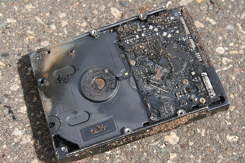
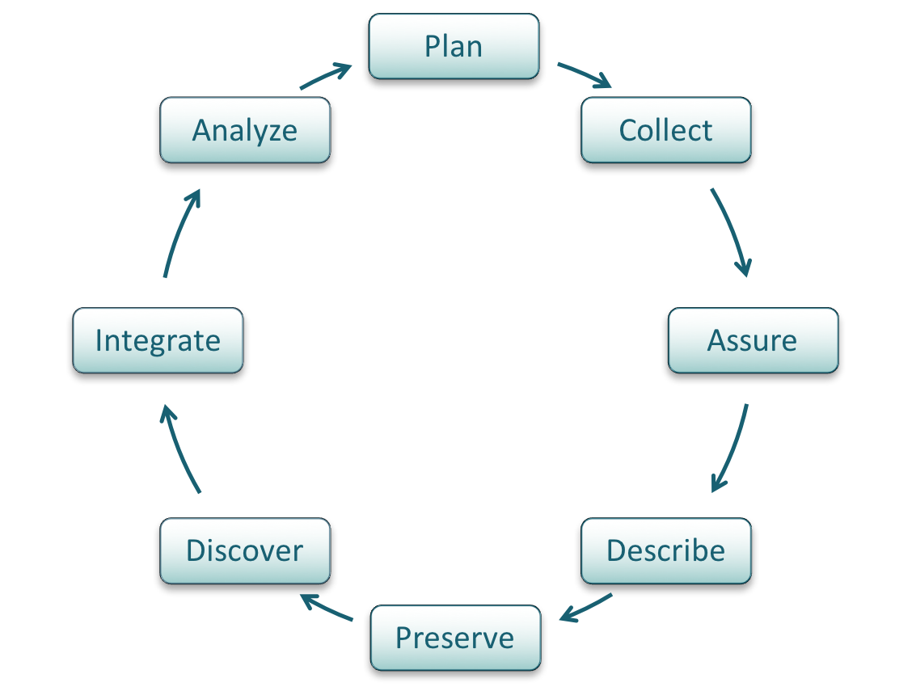

class: center, middle

# Why Data Management?

???
Here are some _notes_. You can format them however you'd like to.
* here are bullets
* this is nice!

---
class: Middle

# Lesson Topics

* The data world around us
* Importance of data management
* The data lifecycle
* The case for data management

???
The topics covered in this module will answer the questions:

---

# Learning Objectives

* Give two general examples of why increasing amounts of data is a concern
* Explain, using two examples, how lack of data management makes an impact
* Define the research data lifecycle
* Give one example of how well-managed data can result in new scientific conclusions

---
class: center middle

# Data Realities...

---
class: center

.wCaption[]

.caption[The world today is filled with science news, from climate change to hurricanes – and it all affects the people inhabiting the earth.]

---

## Data Deluge

.one-third[Data are collected from sensors, sensor networks, remote sensing, observations,
and more. This calls for increased attention to data management and stewardship.]

.two-third[]

---

## A World of Data Around Us

.one-third[The amount of available storage is not keeping up with the amount of data flooding in daily. How do we decide what data we keep?]

.two-third[
.caption[Source: write source here]
]

---

# Data Loss Can Be Caused by

.two-third[
* Natural disaster
* Facilities infrastructure failure
* Server hardware/software failure
* Application software failure
* External dependencies (e.g. PKI failure)
* Format obsolescence ]
.one-third[
*CC Image by Shawyn Morrow on Flickr*

*CC Image by momboleum on Flickr*]
---

# Data Loss Can Be Caused by

.two-third[* Legal encumbrance
* Human error
* Malicious attack by human or automated agents
* Loss of staffing competencies
* Loss of institutional commitment
* Loss of financial stability
* Changes in user expectations and requirements]

.one-third[
*CC Image by Shawyn Morrow on Flickr*

*CC Image by momboleum on Flickr*]

---
class: middle center

# Poor Data Management Affects Everyone

---
class: middle
## Poor Data Management Affects Everyone

**MEDICARE PAYMENT ERRORS NEAR $20B**
*(CNN) December 2004*

> Miscoding and Billing Errors from Doctors and Hospitals totaled $20,000,000,000 in FY
     2003    (9.3% error rate) . The error rate measured claims that were paid despite being
     medically unnecessary, inadequately documented or improperly coded. In some
     instances, Medicare asked health care providers for medical records to back up their
     claims and got no response.  The survey did not document instances of alleged fraud.
    This error rate actually was an improvement over the previous fiscal year (9.8% error rate).

---
class: middle

**AUDIT:  JUSTICE STATS ON ANTI-TERROR CASES FLAWED” (AP) February 2007**

> The Justice Department Inspector General found only two sets of data out of 26
     concerning terrorism attacks were accurate.  The Justice Department uses these
     statistics to argue for their budget.  The Inspector General said the data “appear to be
     the result of decentralized and haphazard methods of collections … and do not appear
     to be intentional.”

---
class: middle

**OOPS! TECH ERROR WIPES OUT Alaska Info” (AP) March 2007**
> A technician managed to delete the data and backup for the $38 billion Alaska oil
     revenue fund – money received by residents of the State.  Correcting the errors cost the
     State an additional $220,700 (which of course was taken off the receipts to Alaska
     residents.)

???
Note:
Data Costs

Consider some of the data management issues that made headlines, affecting agencies and organizations.  Data quality is not limited to any one organization.  These examples show costs (in terms of money lost) due to a lack of data quality control.

---

## Poor Data Management
### Science Example

A wildlife biologist for a small field office provided support for staff GIS needs.
The data were stored on her workstation. When the biologist relocated to another
office, no one understood how the data was stored or managed.

**Solution:** A state office GIS specialist retrieved the workstation and sifted through files trying to salvage relevant data.

**Cost:** 1 work month ($4,000) plus the value of
    data that was not recovered

*The situation could have been worse, because the data were not
being backed up as it would have been if stored on a server.*

---

## Poor Data Management
### Federal Agency Example

.three-fourth[In preparation for a Resource Management Plan, an office discovered 14 duplicate GPS inventories of roads.  However, because none of the inventories had enough metadata, it was impossible to know which inventory was best or if any of the inventories actually met their requirements. ]

.one-fourth[ 
*Source: CC Image by ruffin_Ready on Flickr* ]

.full-width[**Solution:**  Re-Inventory roads

**Cost:** Estimated 9 work months/inventory
        @$4,000/wm
        (14 inventories = $504,000)
]

---

## Importance of Data Management

> Please forgive my paranoia about protocols, standards, and data review.  I'm in the latter stages of a long career with USGS (30 years, and counting), and have experienced much.  Experience is the knowledge you get just after you needed it.

Several times, I've seen colleagues called to court in order to testify about conditions they have observed.

Without a strong tradition of constant review and approval of basic data, they would've been in deep trouble under cross-examination.  Instead, they were able to produce field notes, data approval records, and the like, to back up their testimony.

It's one thing to be questioned by a college student who is working on a project for school.  It's another entirely to be grilled by an attorney under oath with the media present.”- Nelson Williams, Scientist US Geological Survey*

---

## Importance of Data Management

.two-third[

*Source: guardian.uk* ]

.one-third[
The climate scientists at the centre of a media storm over leaked emails were yesterday cleared of accusations that they fudged their results and silenced critics, but a review found they had **failed to be open enough about their work.**
]

---

## Why Manage Data:
### Researcher Perspective

Manage your data for yourself:
* Organize your files (data inputs, analytic scripts, outputs) at various stages of the analytic process
* Track your science processes for reproducibility – match your outputs with exact inputs and transformations that produced them
* Better control versions of data – identify easily versions that can be periodically purged
* Quality control your data more efficiently

---

## Why Data Management:
### Researcher Perspective

.two-third[
* Make backups to avoid data loss
* Format your data for re-use (by yourself or others)
* Be prepared: Document your data for your own recollection, accountability, and re-use (by yourself or others)
* Prepare it to share it – gain credibility
 and recognition for your science efforts!
]

 .one-third[
 *CC Image by UWW ResNet on Flickr*
 ]

---

## Why Data Management:
### Foundation to Advance Science

* Data are a valuable asset – expensive and time consuming to collect

---

## Why Data Management
### Foundation to Advance Science

Data should be managed to:
* Maximize the effective use and value of data & information assets
* Continually improve quality including: accuracy, integrity, integration, timeliness of capture, presentation, relevance & usefulness
* Ensure appropriate use of data and information
* Facilitate data sharing
* Ensure sustainability and accessibility in long term for re-use in science

---

## Data Management Facilitates Sharing and Re-use

.wCaption[]

???
Data management and organization facilitate archiving, sharing and publishing data. These activities feed data re-use and reproducibility in science.

---

## Well-Managed Data Can Result in Re-use, Integration and New Science

.three-fourth[
*Source: *
]

???
By re-using data collected from a variety of sources – eBird database, land cover data, meteorology, and remotely sensed -- this project was able to compile and process the data using supercomputering to determine bird migration routes for particular species.

---

## Data integration

*Images courtesy of Cornell Ornithology Lab*

---

## Where a majority of data end up now…

???
There is an abundance of data and metadata (if it is done) end up in filing cabinets, on discarded hard drives, in hard-copy journals on the library shelves -- or on the web, but many are subscription only journals.

---

## Imagine if data were more accessible….

???
Data should be properly managed and eventually be placed where they are accessible, understandable, and re-usable.

---

## Well managed, publically accessible data is important:
### Why?

Here are a few reasons (from the UK Data Archive):

* Increases the impact and visibility of research
* Promotes innovation and potential new data uses
* Leads to new collaborations between data users and creators
* Maximizes transparency and accountability

---

## Well managed, publically accessible data is important: why?

* Enables scrutiny of research findings
* Encourages improvement and validation of research methods
* Reduces cost of duplicating data collection
* Provides important resources for education and training

*--UK Data Archive*

---

## New Discoveries

A new image processing technique reveals something not before seen in this Hubble Space Telescope image taken 11 years ago: A faint planet (arrows), the outermost of three discovered with ground-based telescopes last year around the young star HR 8799.D. Lafrenière et al., Astrophysical Journal Letters

*D. Lafrenière et al., ApJ Letters*
---

## New Discoveries

*D. Lafrenière et al., ApJ Letters*

> “The first thing it tells you is how valuable maintaining long-term archives can be. Here is a major discovery that’s been lurking in the data for about 10 years!” comments Matt Mountain, director of the Space Telescope Science Institute in Baltimore, which operates Hubble.

---

## New Discoveries

*D. Lafrenière et al., ApJ Letters*

> “The second thing its tells you is having a well calibrated archive is necessary but not sufficient to make breakthroughs — it also takes a very innovative group of people to develop very smart extraction routines that can get rid of all the artifacts to reveal the planet hidden under all that telescope and detector structure.”

---
class: center

# What is the Data Life Cycle?

.wCaption[]

???
A data lifecycle illustrates stages thru which well-managed data passes from the inception of a research project to its conclusion. In the reality of science research, the stages do not always follow a continuous circle.

---

# For Each Stage of the Data Lifecycle

* There are best practices…..and….tools to help!
* The following data management lessons will illustrate in detail each stage of the data lifecycle
* Your well-managed and accessible data can contribute to science in ways you may not even imagine today!

???

The rest of the DataONE Education Modules, handouts, and hands-on exercises are available at: https://www.dataone.org/education-modules

---
## Summary

* The data deluge has created a surge of information that needs to be well-managed and made accessible.
* The cost of not doing data management can be very high.
* Be cognizant of best practices and tools associated with the data lifecycle to manage your data well.
* Many benefits are associated with the act of managing data, including the ability to find, access, understand, integrate and re-use data.

---

# Summary

.one-half[
If data are:

* Well-organized
* Documented
* Preserved
* Accessible
* Verified as to accuracy and validity]

.one-half[Result is:

* High quality data
* Easy to share and re-use in science
* Citation and credibility to the researcher
* Cost-savings to science]

---

# Resources

1. Chatfield, T., Selbach, R. February 2011. Data Management Training Workshop. Bureau of Land Management (BLM).
1. [Strasser, Carly. February 2012. Data Management for Scientists.](http://www.slideshare.net/carlystrasser/oceansciences2012workshop)
1. [UK Data Archive. May 2011. Managing and Sharing Data: Best Practices for Researchers.](http://www.data-archive.ac.uk/media/2894/managingsharing.pdf)
1.  [DAMA International, The DAMA Guide to the Data Management Body of Knowledge.](https://www.dama.org/content/body-knowledge)

---

# About
Participate in our GitHub repo: [https://dataoneorg.github.io/dataone_lessons/](https://dataoneorg.github.io/dataone_lessons/)
The full slide deck (in PowerPoint) may be downloaded from:
[http://www.dataone.org/education-modules](http://www.dataone.org/education-modules)

**Suggested citation:**
DataONE Education Module: Data Management. DataONE. Retrieved November 12, 2016. From [http://www.dataone.org/sites/all/documents/L01_DataManagement.pptx](http://www.dataone.org/sites/all/documents/L01_DataManagement.pptx)

**Copyright license information:**
No rights reserved; you may enhance and reuse for your own purposes.  We do ask that you provide appropriate citation and attribution to DataONE.

