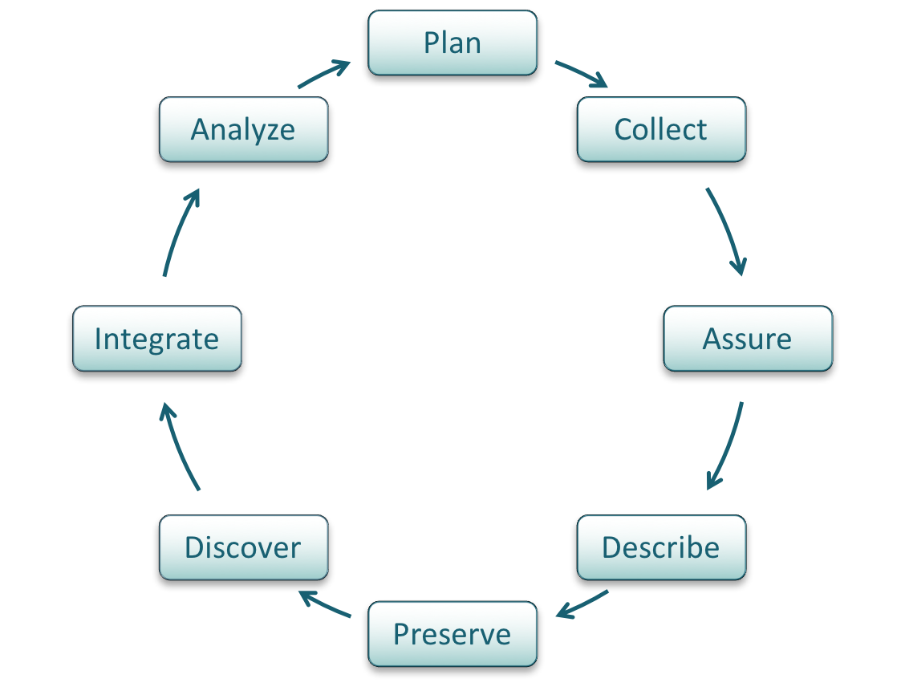

---
title: Data Management Planning
update: Sept. 20, 2016
layout: slides
categories: ed-module
---

# Lesson Topics

.two-third[
- What is a data management plan (DMP)?
- Why prepare a DMP?
- Components of a DMP
- Recommendations for DMP content
- Example of an NSF DMP
]

.one-third[

*CC image by Darla Hueske on Flickr*
]

<!-- These are notes for the presenter -->

???

- The topics covered in this module will answer the questions: 
- What is a data management plan, or DMP? 
- Why would you want to prepare a DMP? 
- What are the components of a DMP? And
- What are the requirements for DMPs prepared for National Science Foundation (or NSF) proposals?  
- We will also go over an example of a data management plan.

---

# Learning Objectives

.two-third[
- After completing this lesson, the participant will be able to:
  - Define a DMP
  - Understand the importance of preparing a DMP
  - Identify the key components of a DMP
  - Recognize the DMP elements required for an NSF proposal
]

.one-third[
 
 *CC image by cybrarian77 on Flickr*
]

---

# The Data Life Cycle

*Photo Attribution: https://www.dataone.org/data-life-cycle*

<!-- These are notes for the presenter -->

???

Data management planning is the starting point in the data life cycle. 
However the plan should be revisited often throughout the project to ensure proper data documentation and management.

---

# What is a Data Management Plan?

- Formal document 
- Outlines what you will do with the data **during** and **after** you complete your research
- Ensures the data is safe for the **present** and the **future**

*From University of Virginia Library*

<!-- These are notes for the presenter -->

???

A DMP is a formal document that outlines what you will do with the data both during and after your research project.  
Data management plans are meant to ensure that the data will be preserved and useful both now and in the future, by both you and other researchers. They should be considered an active doucment, and updated throughout the project to reflect changes in needs or practice.

---

# Why Prepare a DMP? (1)

.two-third[
- Save time
  - Less reorganization later
- Increase research efficiency
 - Ensures you and others will be able to understand and use data in future
]

.one-third[
*Photo Attribution: CC image Cathdew on Flickrby*
]

<!-- These are notes for the presenter -->

???

Why would you want to prepare a data management plan? First and foremost, they save you time. If your data organization scheme is decided on early in the project, or even before data collection begins, you are less likely to spend time organizing the data later. 

Second, preparing a plan for data organization and storage allows you to focus on your research, increasing your efficiency. You are better able to locate and use the data, and share them with collaborators.

If data are documented well both before and during data collection, it prevents problems in understanding data and metadata in the future.

---

# Why Prepare a DMP? (2)

.two-third[
- Easier to preserve data
- Prevents duplication of effort
- Can lead to new, unanticipated discoveries
- Increases visibility of research
- Makes research and data more relevant
- Funding agency requirement
]

.one-third[
*Photo Attribution: CC0 image from The Noun Project*
]

<!-- These are notes for the presenter -->

???

Another reason to prepare a DMP is that it makes the data easier to preserve and archive.  Some data centers and repositories have specific requirements for data documentation, and knowing these requirements in advance saves time and effort that might be spent trying to append data after they are collected. 

By preserving and archiving the data, you are benefiting both yourself and others in your field. If others can easily find and use the data, it might prevent duplication of scientific efforts to re-collect the data. 

Data that you preserve can lead to new, unanticipated discoveries you might not predict. 

It also increases your research visibility and makes your work more relevant. 

Finally, data management plans are now required by most funding agencies. In 2013 the Office of Science and Technology Policy issued a memo to all federal agencies that, among other things, requires them to include a DMP with their proposals. http://www.whitehouse.gov/sites/default/files/microsites/ostp/ostp_public_access_memo_2013.pdf 

---

# Components of a General DMP

1. Information about data type & data format
2. Metadata content and format
3. Policies for access, sharing and re-use
4. Long-term storage and preservation
5. Roles and responsibilities
6. Budget

[
*Photo Attribution: CC0 image from The Noun Project*

<!-- These are notes for the presenter -->

???

For a general DMP, there are five main categories of information that should be included.  Some funders or institutions may require specific elements in a data management plan; you should check with the agency or group for which you are preparing your DMP before beginning.

The slides that follow will go into more detail for each of the general categories on this slide.

---

# 1. Information About Data & Data Format

.one-half[
## 1.1  Description of data to be produced
  - Experimental
  - Observational
  - Raw or derived
  - Physical collections
  - Models and their outputs
  - Simulation outputs
  - Curriculum materials
  - Software
  - Images
  - Etc…
]

.one-half[
[
*Photo Attribution: CC image by Jeffery Beall on Flickr*
]

???

There are many different types of data that may be produced by a research study. Consider this list when describing data that will be produced by the project. These include experimental and observational data, raw or derived data, physical collections, models and their outputs, outputs from simulations, curriculum materials for courses, software, images, etcetera.

More information can be found at https://library.uoregon.edu/datamanagement/datadefined.html 

---

# 1. Information About Data & Data Format

.one-half[
## 1.2  How data will be acquired
  - When?
  - Where?
  
## 1.3 How data will be processed
  - Software used
  - Algorithms
  - Workflows
]

.one-half[
[
*Photo Attribution: CC image by Ryan Sandridge on Flickr*
]

???

In addition to a description of the data that will be generated, the methods of data acquisition should be specified.  Include the who, what, when, where of your collection.

How will the data be processed once it is acquired? This step is important to consider before the project since it may affect how data are organized, what formats are used, and how much should be budgeted for hardware and software. Things to consider are what software may be used, what algorithms will be employed, how these fit into the overall workflow of the project. 

---

# 1. Information About Data & Data Format

.one-half[
## 1.4  File formats
  - Justification
  - Naming conventions

## 1.5  Quality assurance & control during 
  - sample  collection, analysis, and 
  - processing
]

.one-half[
[
*Photo Attribution: CC0 image from The Noun Project*
]

???

You should also describe the file formats you plan to use for the data. When saving files for the long term, it’s best to use standard formats such as dot csv  or dot txt. These are nonproprietary and likely to be readable in the future, regardless of software availability.

Whatever format you choose, you should justify your choice. Consider what standards are commonly used in your scientific discipline when deciding. 

Also describe the naming conventions that will be used for the data sets, files, and folders. By determining these conventions ahead of time, you are less likely to need to change or reorganize files during the project.

You should also identify what quality assurance and control measures you plan to take. Include what will be done during data collection, after data collection, and in the course of data analysis.

---
