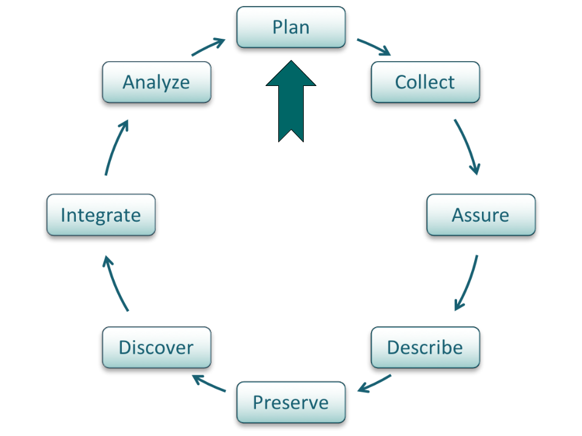
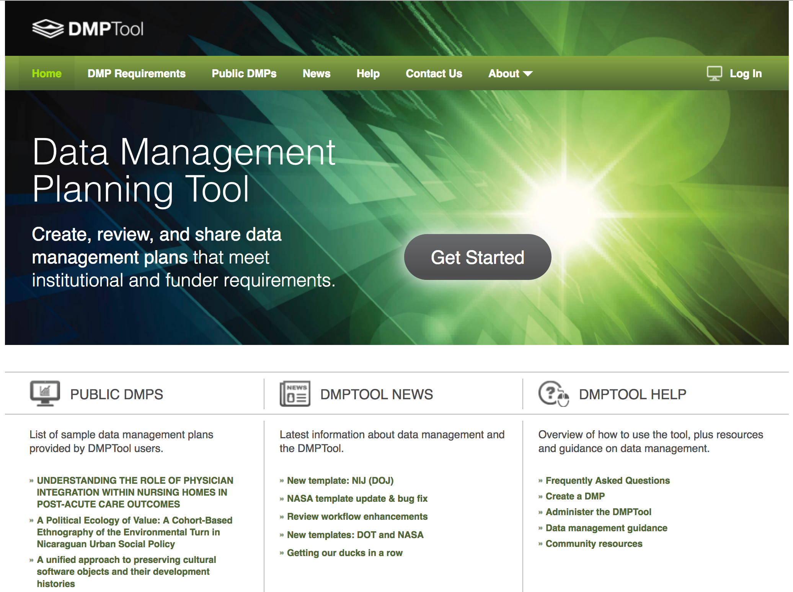
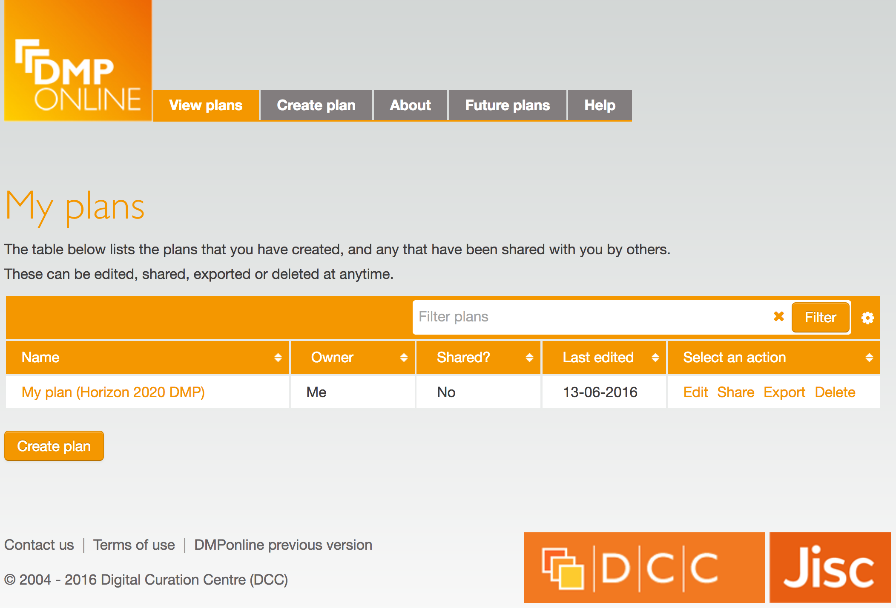

# Lesson Topics

- What is a data management plan (DMP)?
- Why prepare a DMP?
- Components of a DMP
- Recommendations for DMP content
- Example of an National Science Foundation DMP

<!-- These are notes for the presenter -->

???

- The topics covered in this module will answer the questions: 
- What is a data management plan, or DMP? 
- Why would you want to prepare a DMP? 
- What are the components of a DMP? And
- What are the requirements for DMPs prepared for National Science Foundation (or NSF) proposals?  
- We will also go over an example of a data management plan.
---

# Learning Objectives

.two-third[
- After completing this lesson, the participant will be able to:
  - Define a DMP
  - Understand the importance of preparing a DMP
  - Identify the key components of a DMP
  - Recognize the DMP elements required for an NSF proposal
]

.one-third[
 *CC image by cybrarian77 on Flickr*
]

---

# The Data Life Cycle

Data management planning is the starting point in the data life cycle. 

.center[
]

???

Data management planning is the starting point in the data life cycle. 
However the plan should be revisited often throughout the project to ensure proper data documentation and management.

---

# What is a Data Management Plan?

- Formal document 
- Outlines what you will do with the data **during** and **after** you complete your research
- Ensures the data is safe for the **present** and the **future**

.center[
 *CC image by Hope House Press on Unsplash*

???

A DMP is a formal document that outlines what you will do with the data both during and after your research project.  
Data management plans are meant to ensure that the data will be preserved and useful both now and in the future, by both you and other researchers. They should be considered an active doucment, and updated throughout the project to reflect changes in needs or practice.

---

# Why Prepare a DMP?

.two-third[
Saves time
  - Less reorganization later

Increase research efficiency
 - Ensures you and others will be able to understand and use data in future
]

.one-third[
*CC image Cathdew on Flickr*
]

???

Why would you want to prepare a data management plan? First and foremost, they save you time. If your data organization scheme is decided on early in the project, or even before data collection begins, you are less likely to spend time organizing the data later. 

Second, preparing a plan for data organization and storage allows you to focus on your research, increasing your efficiency. You are better able to locate and use the data, and share them with collaborators.

If data are documented well both before and during data collection, it prevents problems in understanding data and metadata in the future.

---

# Why Prepare a DMP?, continued

.two-third[
- Easier to preserve data
- Prevents duplication of effort
- Can lead to new, unanticipated discoveries
- Increases visibility of research
- Makes research and data more relevant
- Funding agency requirement
]

.one-third[
*CC0 image from The Noun Project*
]

???

Another reason to prepare a DMP is that it makes the data easier to preserve and archive.  Some data centers and repositories have specific requirements for data documentation, and knowing these requirements in advance saves time and effort that might be spent trying to append data after they are collected. 

By preserving and archiving the data, you are benefiting both yourself and others in your field. If others can easily find and use the data, it might prevent duplication of scientific efforts to re-collect the data. 

Data that you preserve can lead to new, unanticipated discoveries you might not predict. 

It also increases your research visibility and makes your work more relevant. 

Finally, data management plans are now required by most funding agencies. In 2013 the Office of Science and Technology Policy issued a memo to all federal agencies that, among other things, requires them to include a DMP with their proposals. http://www.whitehouse.gov/sites/default/files/microsites/ostp/ostp_public_access_memo_2013.pdf 

---

# Components of a General DMP

.two-third[
1. Information about data type & data format
2. Metadata content and format
3. Policies for access, sharing and re-use
4. Long-term storage and preservation
5. Roles and responsibilities
6. Budget
]

.one-third[
*CC0 image from The Noun Project*
]

???

For a general DMP, there are five main categories of information that should be included.  Some funders or institutions may require specific elements in a data management plan; you should check with the agency or group for which you are preparing your DMP before beginning.

The slides that follow will go into more detail for each of the general categories on this slide.

---

# Information About Data & Data Format

.one-half[
What type of data will be produced?
  - Experimental
  - Observational
  - Raw or derived
  - Physical collections
  - Models and their outputs
  - Simulation outputs
  - Curriculum materials
  - Software
  - Images
]

.one-half[
*CC image by Jeffery Beall on Flickr*
]

???

There are many different types of data that may be produced by a research study. Consider this list when describing data that will be produced by the project. These include experimental and observational data, raw or derived data, physical collections, models and their outputs, outputs from simulations, curriculum materials for courses, software, images, etcetera.

More information can be found at https://library.uoregon.edu/datamanagement/datadefined.html 

---

# Information About Data & Data Format, continued

.one-half[
How data will be acquired
  - When?
  - Where?
  
How data will be processed
  - Software used
  - Algorithms
  - Workflows
]

.one-half[
*CC image by Ryan Sandridge on Flickr*
] 

???

In addition to a description of the data that will be generated, the methods of data acquisition should be specified.  Include the who, what, when, where of your collection.

How will the data be processed once it is acquired? This step is important to consider before the project since it may affect how data are organized, what formats are used, and how much should be budgeted for hardware and software. Things to consider are what software may be used, what algorithms will be employed, how these fit into the overall workflow of the project. 

---

# Information About Data & Data Format, continued 

.one-half[
File formats
  - Justificaty your choice
  - Follow naming conventions

Quality assurance & control during 
  - sample collection, analysis, and processing
]

.one-half[
*CC0 image from The Noun Project*
]

???

You should also describe the file formats you plan to use for the data. When saving files for the long term, it’s best to use standard formats such as dot csv  or dot txt. These are nonproprietary and likely to be readable in the future, regardless of software availability.

Whatever format you choose, you should justify your choice. Consider what standards are commonly used in your scientific discipline when deciding. 

Also describe the naming conventions that will be used for the data sets, files, and folders. By determining these conventions ahead of time, you are less likely to need to change or reorganize files during the project.

You should also identify what quality assurance and control measures you plan to take. Include what will be done during data collection, after data collection, and in the course of data analysis.

---

# Information About Data & Data Format, continued

Existing data
  - If existing data are used, what are their origins?
  - Will the data be combined with existing data?
  - What is the relationship between new data and existing data?

How will data be managed in short-term?
  - Version control
  - Backing up
  - Security & protection
  - Who will be responsible?

[
*CC0 image from The Noun Project*
]

???

It is also important to identify any existing data you may use, including their origins, and how the data you collect will relate to those data. 

If the dataset will be combined in the future with existing data, how you will ensure that formats are compatible? What is the relationship between the data you are collecting and what already exists?

You should describe how data will be managed in the short term.  How will you keep track of different versions of the data and analyses? How will you back up the data?  Are servers available at your institution? Consider both on-site and off-site backup options.  Describe how you will ensure the security of the data, especially if the data are sensitive. Who will have access to the data? 

Be sure to identify who will be responsible for short-term data management. Assign roles and responsibilities for data management, archiving, version control, and backing up.

---

# Metadata Content & Format

.one-half[
**Metadata** is defined as: 
- Documentation and reporting of data

**Metadata** contains: 
- Contextual details: Critical information about the dataset
- Information important for using the data
- Descriptions of temporal and spatial details, instruments, parameters, units, files, etc. 
]

.one-half[
*CC0 image from The Noun Project*
]

???

The second major category for a DMP is metadata content and format. First, we should define metadata. Metadata is data documentation. It includes contextual details about data collection and any information that is important for using and understanding the data. Examples of some of the many components of metadata are temporal and spatial details, instruments used, parameters, units, etcetera. 

---

# Metadata Content & Format, continued

.two-third[
What metadata are needed?
  - Any details that make data meaningful

How will metadata be created and/or captured?
  - Lab notebooks? GPS units? 
  - Auto-saved on instrument?

What format will be used for the metadata?
  - Standards for community
  - Justification for format chosen
]

.one-third[
*CC0 image from The Noun Project*
]

???

This section of the DMP should first describe how the metadata will be created or captured.  For instance, will field or lab notebooks be used to record critical information? Will instruments such as GPS units be implemented for data collection? Will metadata be saved automatically by the instrument you are using?

Indicate what format, or metadata standard, will be used.  There are many different metadata standards available. Ask colleagues about what is commonly used in your discipline. Also, check with the repository or data center with which you plan to archive the data - many have metadata format requirements.   Justify the format you choose for your metadata, considering your research community, the data center you will use, and the nature of the project.

---

# Policies for Access, Sharing, Reuse

.two-third[
Obligations for sharing
  - Funding agency
  - Institution
  - Other organization
  - Legal

Details of data sharing
  - How long?
  - When? 
  - How access can be gained?
  - Data collector rights

Ethical/privacy issues with data sharing
]

.one-third[
*CC0 image from The Noun Project*
]

???

The third section of a data management plan should describe policies for access, sharing, and reuse of the data. 

What obligations do you have to share the data? Sharing requirements may come from your institution, your funder, or your professional society. There may also be legal obligations for sharing the data. 

You should also describe the details of how you will share the data.  How long after collection will data be available? When will access be granted to interested users?  Who will have access to those data? How will they gain access?  Will the data collector, creator, or PI have exclusive rights to data for a certain period of time?

Be sure to address any ethical or and privacy issues associated with the data. For example, If the data involves human subjects, endangered species, or locations of sensitive habitats, you may have special considerations for data sharing.

---

# Policies for Access, Sharing, Reuse, continued 

.two-third[
Intellectual property & copyright issues
  - Who owns the copyright?
  - Institutional policies
  - Funding agency policies
  - Embargos for political/commercial reasons

Intended future uses/users for data

Citation
  - How should data be cited when used?
  - Persistent citation?
]

.one-third[
*CC0 image from The Noun Project*
]

???

Describe any intellectual property or copyright issues associated with the data.  Who owns the copyright to the data? Institutions and/or funding agencies often have a policy for intellectual property and copyright. There may be other considerations such as embargos on data due to patents, politics, or journal requirements.
 
Be prepared to describe the intended future uses and users of the data. This helps determine the most appropriate data center to archive the data.
 
You should also describe how the data should be cited when used. It is best to establish a persistent identifier or citation, such as a DOI, or digital object identifier.  Consult policies and options with the data archive you choose.

---

# Long-term Storage & Data Management

.two-third[
* What data will be preserved?
* Where will it be archived?
 * Most appropriate archive for data
 * Community standards
* Data transformations/formats needed
 * Consider archive policies
* Who will be responsible?
 * Contact person for archive
]

.one-third[
*CC0 image by Samuel Zeller on Unsplash*
]
  
???
  
The fourth major section of a data management plan describes plans for long term storage and data management. 
 
First, you should describe what data will be preserved. Not all data should necessarily be preserved. In general, any raw data should be kept.  Also, any data products that were particularly expensive or time consuming to obtain should be preserved. Any data that is not easily replaceable should be kept.
 
Second, identify where you will archive the data. Find out what archives or data centers are commonly used in your discipline. Data centers usually last longer than lab or personal websites. Check to see if your institution has a repository available to researchers. Also, ask colleagues in your field where data are commonly archived.
 
Third, your data management plan should describe what data transformations and formats need to be preserved to ensure future usability of the data. Contact the data repository you will use early in the project to be sure you have data in the correct format. This will save time later.
 
Fourth, identify the person who will be responsible for maintaining contact information with the data center. This is especially important if there are restrictions on data use, for instance a requirement that potential users contact the data collector before reusing data.

---

# Roles and responsibilities

.two-third[
Outline the roles and responsibilities for implementing this data management plan.
- For example:
  - Who will be responsible for data management and for monitoring the data management plan?
  - How will adherence to this data management plan be checked or demonstrated?
  - What process is in place for transferring responsibility for the data?
  - Who will have responsibility over time for decisions about the data once the original personnel are no longer available?
]

.one-third[
*Chameleon Design on the NounProject*
]
  
???
  
Explain how the responsibilities regarding the management of your data will be delegated. This should include time allocations, project management of technical aspects, training requirements, and contributions of non-project staff - individuals should be named where possible. Remember that those responsible for long-term decisions about your data will likely be the custodians of the repository/archive you choose to store your data. While the costs associated with your research (and the results of your research) must be specified in the Budget Justification portion of the proposal, you may want to reiterate who will be responsible for funding the management of your data. [from DMPTool, NSF-ENG template]

---

# Budget

.two-third[
Anticipated costs
- Time for data preparation & documentation
- Hardware/software for data preparation & documentation
- Personnel
- Archive costs

Include how costs will be paid
]

.one-third[
*CC0 image from The Noun Project*
]

???

The fifth and final component of a general DMP is budget.  Although most proposals have separate budget requirements and do not require a budget as part of the DMP, it is important to consider costs that might be incurred in the process of managing and preserving the data. 
 
Consider costs such as salary time needed for data preparation and documentation, hardware and software requirements, personnel needed to prepare data, and costs associated with archiving the data. 
 
You should identify how the costs associated with your DMP will be paid.

---

# Tools for Creating Data Management Plans

.one-half[
**DMPTool**
https://dmptool.org/
  

]

.one-half[
**DMPOnline**
https://dmponline.dcc.ac.uk/
  

]

???

There are several tools available for creating data management plans. Two of the most commonly used are the DMPTool (US funders only) and DMP Online (UK/EU funders only).  

Both operate as “wizards” and provide prompts for the user to fill out in order to create their data management plan. You can save your plan, print it, or export it to your computer.  

---

# NSF DMP Requirements

***From Grant Proposal Guidelines:***

> * the **types of data**, samples, physical collections, software, curriculum materials, and other materials to be produced in the course of the project
> * the **standards to be used for data and metadata format** and content (where existing standards are absent or deemed inadequate, this should be documented along with any proposed solutions or remedies)
> * **policies for access and sharing**, including provisions for appropriate protection of privacy, confidentiality, security, intellectual property, or other rights or requirements
> * policies and **provisions for re-use, re-distribution**, and the production of **derivatives**	
> * **plans for archiving** data, samples, and other research products, and for preservation of access to them 

http://www.nsf.gov/pubs/policydocs/pappguide/nsf16001/gpg_2.jsp#dmp

???

We will now focus on NSF’s data management plans.  As of January 2011 NSF requires that a two page data management plan be included with submitted proposals. This is in addition to the 15 pages for the proposal.

Plans for data management and sharing of the products of research. Proposals must include a supplementary document of no more than two pages labeled “Data Management Plan”. This supplement should describe how the proposal will conform to NSF policy on the dissemination and sharing of research results (in AAG), and may include the 5 main components on this slide.

---

# NSF DMP Requirements, continued

***Summarized from the Award & Administration Guide:***
**Dissemination and Sharing of Research Results**

> * Promptly publish with appropriate authorship
> * Share data, samples, physical collections, and supporting materials with others, within a reasonable timeframe 
> * Share software and inventions 
> * Investigators can keep their legal rights over their intellectual property, but they still have to make their results, data, and collections available to others 
> * Policies will be implemented via 
  - Proposal review
  - Award negotiations and conditions
  - Support/incentives

http://www.nsf.gov/pubs/policydocs/pappguide/nsf16001/aag_6.jsp#VID4

???

There is more information from NSF about requirements in section 4 of the Award and Administration guide. It states that research results should be promptly published, data should be shared, software and inventions should be shared, and describes some intellectual property and policy issues.
 
In addition to these general requirements, there are directorate- and division-specific requirements that will likely be updated in the near future. Not all directorates and divisions have DMP requirements available yet.

---

# Summary

.two-third[
DMPs are an important part of the data life cycle. They save time and effort in the long run, and ensure that data are relevant and useful for others. Most funding agencies now require DMPs

Major components of a DMP:
1. Information about data type & data format
2. Metadata content and format
3. Policies for access, sharing and re-use
4. Long-term storage and data management
5. Budget
]

.one-third[
*CC0 image from The Noun Project*
]

???
http://www.whitehouse.gov/sites/default/files/microsites/ostp/ostp_public_access_memo_2013.pdf*

---

# Resources

* University of Virginia Library. Accessed June 24, 2015 at http://data.library.virginia.edu/data-management/plan/.
* Digital Curation Centre Accessed June 26, 2015 at http://www.dcc.ac.uk/resources/data-management-plans. 
* Oregon State University Library. Accessed June 27, 2015 at http://guides.library.oregonstate.edu/dmp/policies.
* NSF Grant Proposal Guidelines. Accessed June 26, 2015 at http://www.nsf.gov/pubs/policydocs/pappguide/nsf16001/gpg_2.jsp#dmp. 
* Inter-University Consortium for Political and Social Research. Accessed June 26, 2015 at http://www.icpsr.umich.edu/icpsrweb/ICPSR/dmp/index.jsp. 
* DataONE. Accessed June 26, 2015 at https://www.dataone.org/data-management-planning. 

---
# About
Participate in our GitHub repository: [https://github.com/DataONEorg/Education](https://github.com/DataONEorg/Education)

**Suggested citation:**
DataONE Education Module: Data Management Planning. DataONE. Retrieved November 12, 2016. From [https://dataoneorg.github.io/Education/](https://dataoneorg.github.io/Education/)

**Copyright license information:**
No rights reserved; you may enhance and reuse for your own purposes.  We do ask that you provide appropriate citation and attribution to DataONE.

