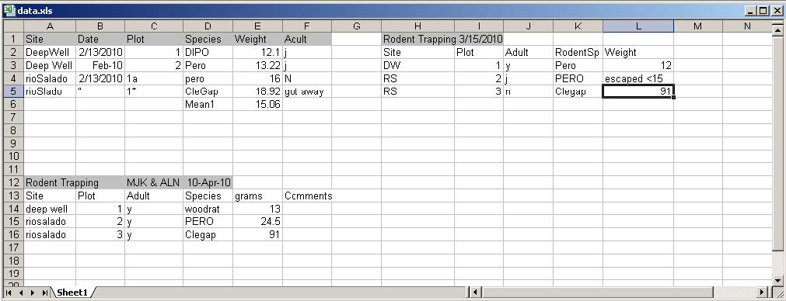
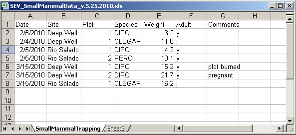
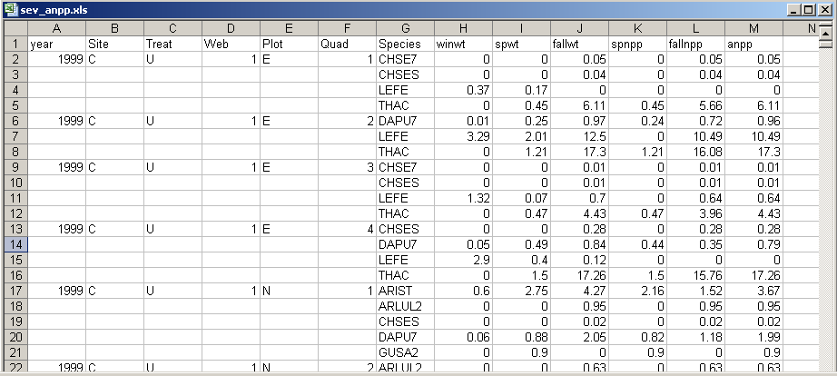

## Lesson Topics

.full-width[
* Best Practices for Creating Data Files
* Data Entry Options
* Data Integration Best Practices
* Data Manipulation Options
]

???
In this module we will be looking at best practices as related to the creation of data files.  We will also discuss data entry schemes that help ensure data quality, and data manipulation options

---

## Learning Objectives

.full-width[
* Recognize and plan for inconsistencies that can make a dataset difficult to understand and/or manipulate
* Describe characteristics of stable data formats and list reasons for using these formats
* Identify data entry tools
* Identify validation measures that can be performed as data is entered
* Review best practices for data integration
* Describe the basic components of a relational database]

---

## Goals of Data Entry

.full-width[
* Create quality data sets that are:
  * Valid
  * Organized to support ease of use and reuse]

???
The goals of data entry are to create data that are valid, or have gone through a process to assure quality, and are organized to support use of the data or for ease of archiving.   
---

## Example: Poor Data Entry

class: center
]

???

These are data entered in to Excel from a small mammal trapping study.   Each block of data represents a different trapping period (2/13, 3/15, and 4/10/2010).  Inconsistencies in how the data were entered for each sampling period  make the data difficult to analyze and difficult for anyone but the data collector to understand.  Note that the date is listed in different places in each block.  Date is a column in the first block, but listed in the header in the block on the right. Inconsistent date formats were also used.  In one place the date is formatted  as day-month-year, with the first three letters of the month spelled out, while elsewhere the format is  mm/dd/yyyy.  Note also that the order of the columns is inconsistent- Site, Date in the first block, and Site, Plot in the bottom block.   Even the columns are named differently.    Species is called Species in the first block, and RodentSp in the block on the right.  This can be confusing to any user who must try to make sense of these data!    And it would be a nightmare to try to write metadata for this spreadsheet.   

---

## Example: Poor Data Entry, continued

class: center
]

???
There are other problems with how these data was entered. Naming of sites is also inconsistent.  For instance, Deep Well is used in the first block vs. DW in the block on the right.  The file contains several typos, also such as rioSalado vs. rioSlado.   A human can figure out what each of these site names refers to, but the names would have to be harmonized for a statistical program to use.   It would be easier to filter for just Deep Well (with a space), and not have to know you need to filter for DeepWell (no space), also.   Similarly, in one place a species code is capitalized PERO, and lowercase elsewhere.   

Further, in the first block of data, a mean was calculated for the weight of the rodents.  The value for that mean, called Mean1, is in the same column as the weights of the individual animals.  In later manipulations of these data, it would be easy to copy that value as though it represented the weight of a single animal.   It is bad practice to mix types of information in one column.   It is best for raw data should be maintained in one file, and calculations should be done elsewhere.   
In addition, there is text data mixed with numeric data in the Weight column in the block on the right – it says “escaped < 15” (presumably indicating that a rodent less than 15 grams escaped).  A statistical program will not know how to deal with text data mixed with numeric data.   What is the mean of 12, 91, and “escaped < 15”?

To analyze all these data using statistical software, and to make it much easier to understand by any user, these data will need to be organized in to a column for each variable.  Therefore it essential that only one type of info be entered in to each column, and that spellings, codes, formats, etc. be consistent.

---

## Recommended Practices

.full-width[
* Columns of data are consistent: only numbers, dates, or text
* Consistent Names, Codes, Formats (date) used in each column
* Data are all in one table, which is much easier for a statistical program to work with than multiple small tables which each require human intervention]

]

???

This shows the same data entered in a way that would make it easy to understand and analyze.  
The data are not entered in separate blocks arrayed in a single worksheet.  They are entered in one table with columns defined by variables Date, Site, Plot, Species, and Weight, Adult, and Comments that are recorded for each sampling event.  

The columns of data have consistent types.   Each column contains only numbers, dates, or text.
There are consistent names, codes, and formats used in each column.  For instance, all dates are in the same format (mm/dd/yyyy), and there are no typos in the Site Names.  Species are all referred to by standard codes.  Therefore, if the user wanted to subset the data for species = `PERO`, they could easily filter the file for just those data.  Additionally,  there are only numeric data in the Weight column, so a statistical program or Excel could readily calculate statistics on this column.    Preparing metadata for this file would also be straightforward.   

---

## Recommended Practices, continued

.full-width[
* Create descriptive column names without spaces or special characters
  * `Soil T30` to `Soil_Temp_30cm`
  * `Species-Code` to "Species_Code (Avoid using -,+,*,^ in column names. Some software may interpret these symbols as an operator)"
* Use a descriptive file name.  For instance, a file named `SEV_SmallMammalData_v.5.25.2010.csv` indicates the project the data is associated with (SEV),  the theme of the data (SmallMammalData) and also when this version of the data was created (v.5.25.2010).   This name is much more helpful than a file named mydata.xls.]  

???
One best practice in data entry is to create descriptive column names without spaces or special characters.  Sometimes statistical programs have special uses for some characters, so you should avoid using them in your data file.   

---

## Recommended Practices, continued

.full-width[
* Missing data
* Preferably leave field empty (NULL = no value)
* In numeric fields, use a distinct value such as 9999 to indicate a missing value 
* In text fields, use NA (“Not Applicable” or “Not Available”)
* Use Data flags in a separate column to qualify missing value
  * M1 = missing; no sample collected, E1 = estimated from grab sample]
        
        
???
A preferred way to identify missing data is with an empty field. If for some reason an empty cell is not possible then use an impossible value such as 9999 in numeric fields and in text fields use NA.
Use data flags in a separate column to qualify empty cells.  For instance, in this example of stream chemistry data, the flag M1 indicates that the sample was not collected at that interval.   

---

## Recommended Practices, continued

.full-width[
* Enter complete lines of data]

???
There are a lot of great things about spreadsheets, but one must be wary of problems that can arise from their use.  Spreadsheets, for instance, can sort one column independently of all others.   The data entry person for the upper spreadsheet elected to leave empty cells for site, treat, web, plot, quad.  It’s obvious why and doesn’t cause the human reader any problems.  But if someone happens to decide to sort on Species, it is no longer clear which species maps to which time period or to which measurements.  This could make the spreadsheet unusable.   It is good practice to fill in all cells when using a spreadsheet for data entry.   
A best practice is to enter complete lines of data, so that the data are sorted on one column without loss of information

---

## Best Practices

.full-width[
* For the long term, store data in a consistent format that can be read well in to the future and that can be used by any application now or in the future 
* Appropriate file types include:
  * Non-proprietary: use an open, documented standard 
  * Common usage by research community: Standard representation (ASCII, Unicode) 
  * Unencrypted 
  * Uncompressed
* ASCII formatted files are likely to be readable into the future
  * Use ASCII (comma-separated) for tabular data
]

???
Archiving your data publicly will require that it be stored in a non-proprietary format such as ASCII.   A common practice is to store data in a comma-delimited text file.   There have been many instances where data sets have been lost because they were stored in a proprietary format which becomes obsolete.  

---

## References

1. Best Practices for Preparing Environmental Data Sets to Share and Archive. September 2010. Les A. Hook, Suresh K. Santhana Vannan, Tammy W. Beaty, Robert B. Cook, and Bruce E. Wilson. http://daac.ornl.gov/PI/BestPractices-2010.pdf

---

## Data Entry Tools

.full-width[
* Two common tools: Google Docs, Excel
* Data entry tools typically perform data validation which allows you to control the kind of information that is entered. With data validation, you can:
  * provide users with a list of choices 
  * restrict entries to a specific type or size
* Using data validation improves the quality of data by preventing the entry of errors.]  

---

## Google Docs Forms

???
This is an example of a data entry form created in Googledocs.  Such forms are easy to create, and free.   Here, a form field is being created that will allow the user to select from three locations where data were collected.   In practice, GoogleDocs work best for entering survey data, or entering lots of text data.  

The advantages to using a data entry form, as opposed to entering data directly in to a spreadsheet, is that the form can enforce data entry rules – that is, you can create a pick-list of items for a user to select from.  That way, you have consistent info being entered, as a user will always enter Deep Well, instead of DW.    

---

* Data entered into a Google doc form is stored in a spreadsheet.  

---

## Excel

???
Excel is a very popular data entry tool.   It also allows you to enforce data validation rules.   Here, a dropdown list has been generated that allows the user to only select entries from this list.   In this way, only defined species codes get entered, and the data is consistent.     
---

## Excel: Data Validation

???
Here is another example of data validation using Excel.  Height has been defined to contain values between 11 and 15.  When 20 is entered, the user is told that they have entered an illegal value.   

---

## Spreadsheet versus Relational Database

.one-half[
* Great for charts, graphs, calculations
* Flexible about cell content type—cells in same column can contain numbers or text
** Easy to use – but harder to maintain as complexity and size of data grows
]

.one-half[
* Easy to query to select portions of data
* Data fields are typed – For example, only integers are allowed in integer fields
* Columns cannot be sorted independently of each other
* Steeper learning curve than a spreadsheet
]

???
Some researchers are turning to database software instead of spreadsheets for their data management needs.   Databases are a powerful option for storing and manipulating datasets.   Here, we list some of the pros and cons of spreadsheets vs. databases (which include software such as Oracle, MySQL, SQL Server and Microsoft Access).  Spreadsheets are good at making charts and graphs, and doing calculations.  They are easy to use, but they become unwieldly as the number of records grows and a dataset becomes complex.  Databases, on the other hand, work well with high volumes of data, and they are much easier to query in order to select data having particular characteristics.   They also maintain data integrity – that is, one column cannot be sorted separately of all others, as spreadsheets can.  Databases also enforce data typing, which is a best practice.  This means that only data of type ‘text’, for example, can be entered in to a column of type ‘text’.  This helps prevents data entry errors.    Databases do have a steeper learning curve than a spreadsheet such as Excel does, but there are many benefits

---

## What is a relational database?

???
A relational database matches data stored in tables by using common characteristics found within the data set.  This helps preserve data integrity and also makes it possible to flexibly mix and match data to get different combinations of information.   A database consists of a set of tables, defined relationships between them (which table is related to which other table), and also a powerful command language that facilitates data manipulation.   

Here, a dataset for plant phenology has been divided into three tables, one describing site information, one describing characteristics of each sample, and one describing the plant species found.   

Relational databases are currently the predominant choice in storing data like financial records, medical records, personal information and manufacturing and logistical data.

---

## Database Features: Explicit control over data types

???
Database features includes explicit control over data types and has the advantages of quality control and performance.   Here, in the plant phenology table, only dates are allowed in the Date column, only text is allows in the site column, only real numbers are allowed in the Height column.   If a user tries to enter a ? Under flowering, the database will reject the entry.   This is useful for defining how data is to be entered.   

---

## Relationships are defined between tables

???
Relationships can be defined between two sets of data or in this example between two tables.  Suppose that you have two tables used in the plant phenology study, one for observations and one for sites, and you want a table that contains both observations and the latitude and longitude of your sites.   Because both tables contain Site info, they can be joined to create a table containing the info you want.   

---

## Powerful Command Language called Structured Query Language (SQL)

???
Database features also includes a powerful command language called Structured Query Language (SQL)

The table at the top of this slide is named SoilTemp in the database.  The first example SQL command returns all records collected on 2010-02-01.   

The second select statement, returns all records from table SoilTemp where treatment is N and SensorDepth is 0.   From this example you can get a sense of how easy SQL is to use to subset data based on different criteria.  This is only very simple SQL.   There is much, much more than can be done with it.   

---

## Data Entry with a Database

* Forms can be created that make entering data in to a relational database as easy as entering it in to Excel.  The screenshot below shows embedded forms that were quickly generated in MS Access for adding data to three tables in a database of plant cover measurements

---

## Review: Planning for Data Entry

.full-width[
* Be aware of Best Practices in your domain when designing data file structures
* Choose a data entry method that allows some validation of data as it is entered
* Consider investing time in learning how to use a database if datasets are large or complex]

???
Be aware of best practices when designing data file structures. Choose a data entry method that allows validation of data entered and be sure to invest time in learning how to use a database especially if the dataset are large or complex. 

---

## If you want to try a database:

.full-width[* Consider trying one of these:
  * Personal, single-user databases can be developed in MS Access, which is stored as a file on the user’s computer.  MS Access comes with easy GUI tools to create databases, run queries, and write reports.   
  * A more robust database that is free, accommodates multiple users and will run on Windows or Linux is MySQL.   GUI interfaces for MySQL include phpMyadmin (free) and Navicat (inexpensive).] 
  
---

## To learn more about designing a relational database:

1. Database Design for Mere Mortals: A Hands-On Guide to Relational Database Design (2nd Edition)  by Michael J. Hernandez.  Addison-Wesley.  2003.  
2. Fundamentals of Relational Database Design by Paul Litwin. http://r937.com/relational.html. (Accessed May 12, 2016). 

---

## Data Integration Best Practices

.full-width[
* Maintain dataset provenance
  * Document transformations
  * Beware of accidental duplication
* Review metadata for compatibility of context, methods, and meaning
  * For what purpose was the data collected?
  * How was the data collected?
  * Is it sensible to combine these datasets?]

???
At times you will need to combine multiple datasets into a superset in order to address your research question.  Here are the best practices that should be followed when integrating two or more datasets.

---

## Data Integration Best Practices

.full-width[
* Ensure compatibility
  * Convert to common units
  * Choose appropriate numeric precision
  * Evaluate and standardize missing value codes
* Document all assumptions
  * What assumptions underlie the original datasets?
  * What assumptions did you make in combining the datasets?]

---

## Data Integration Best Practices

.full-width[
* Recognize that you are creating a new dataset
  * Revisit the data life cycle to ensure the new dataset is properly documented, validated, and preserved
* Use reproducible workflows
  * Enable transparency and reproducibility in the integration process
  * Ensure others understand and can evaluate your decision making process.
  * Automate the integration as much as possible, especially when integrating many or large datasets]

---

# Data Integration Best Practices

.full-width[
* Ensure attribution of original dataset owners and respect data usage agreements
  * Example resource: 
   <footnote>Jones et al. (2006) The New Bioinformatics: Integrating ecological data from the gene to the biosphere. Annual Review of Ecology and Systematics 37:519-544 </footnote>
* Example citation to the related dataset from the Dryad repository:
  <footnote>Jones, Matthew B., Schildhauer, Mark P., Reichman, O. J., and Bowers, Shawn. 2012. Data from "The new bioinformatics: integrating ecological data from the gene to the biosphere." Dryad Digital Repository. http://dx.doi.org/10.5061/dryad.qb0d6?ver=2012-07-16T14:42:48.559-04:00. </footnote>
  ]

---

## Data Manipulation

.full-width[
* Useful for analyzing, subsetting and transforming data
* Can be used to check and assure quality data
* Options include SAS, SPSS, R, and Matlab (not free)
    * SAS:  Has comprehensive support
    * SPSS:  Has a user-friendly GUI
    * Matlab: Analysis and Visualization platform that has “toolboxes” available for different disciplines, such as modeling or genomic analyses]

---

## Using R

.full-width[
* Free (http://www.r-project.org/index.html)
* Produces publication quality graphics
* Lots of forums from which to get help
* Software (such as Kepler for developing workflows) will integrate analytical components written in R ]

---

## Review: Selecting tools for data storage and use

.full-width[
* Tools such as (but not limited to) spreadsheet tools such as MS Excel and relational databases (MS Access, MySQL, and more) can provide structure, flexibility and potential for working more easily with datasets but also require planning
* Selection of a database or spreadsheet tool depends on the relationships between the data, and how it will be used, as well as other considerations re: time, resources, output.
]
---

## Review: Data Integration & Manipulation

.full-width[
* Maintaining provenance (a trail of custody and decisions) is important when integrating more than one dataset
* Documenting and understanding context and relationships, as well as changes is crucial when creating a new dataset (any time you combine two or more disparate datasets)
* Create a transparent, reproducible workflow
* Make sure to provide proper attribution and citation to all resources, including the original dataset. 
* Tools such as R, Matlab, and others can be useful in establishing workflows and accessing datasets
]
---

## About

Participate in our GitHub repo: [https://dataoneorg.github.io/dataone_lessons/](https://dataoneorg.github.io/dataone_lessons/)

The full slide deck (in PowerPoint) may be downloaded from:
[http://www.dataone.org/education-modules](http://www.dataone.org/education-modules)

**Suggested citation:**
DataONE Education Module: Data Management. DataONE. Retrieved November 12, 2016. From [http://www.dataone.org/sites/all/documents/L01_DataManagement.pptx](http://www.dataone.org/sites/all/documents/L01_DataManagement.pptx)

**Copyright license information:**
No rights reserved; you may enhance and reuse for your own purposes.  We do ask that you provide appropriate citation and attribution to DataONE.

---

