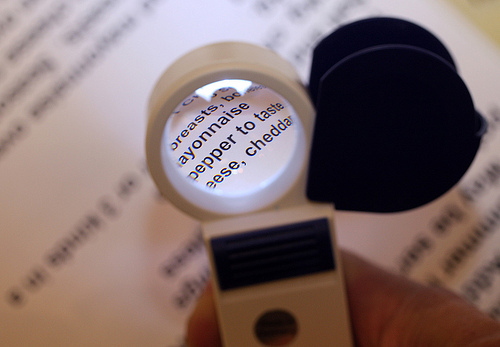
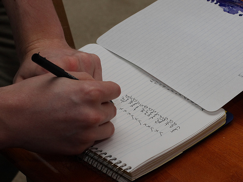
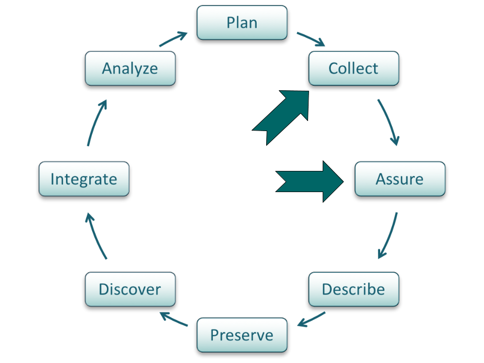
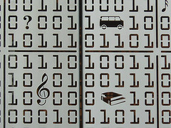
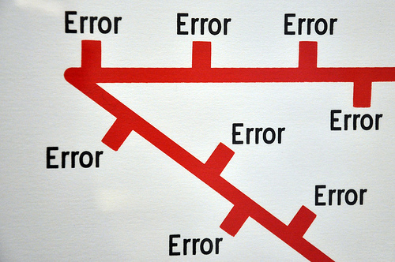
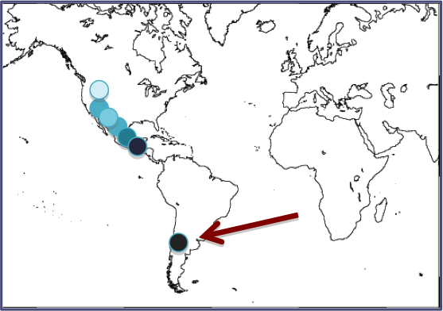

# Lesson Topics

.one-half[
Definitions
* Quality assurance and Quality control
* Data contamination
* Types of errors

QA/QC best practices
* Before data collection
* During data collection/entry
* After data collection/entry
]

.one-half[
.center[
*CC image by cobalt123 on Flickr*]
]

???

First we will define quality assurance and quality control, and review definitions for other related terms including data contamination, and review the common types of errors in data. Then we will review some best practices that can be implemented before data collection, during data collection, and after data collection to ensure high-quality data. 

---

# Learning Objectives

After completing this lesson, the participant will be able to: 
* Define data quality control and data quality assurance
* Perform quality control and assurance on their data at all stages of the research cycle

.center[
*CC image by 0xFCAF on Flickr*]

???

After completing this module, you will be able to define quality control and quality assurance.  You will also understand how to perform quality control and assurance on your data at all stages of the data life cycle.  

---

# The Data Life Cycle

.center[

*DataONE Life Cycle*]

???

Quality control and quality assurance should be implemented throughout the data life cycle, but here we focus on measures that can be taken during collection.  The “assure” step in the data life cycle closely ties in with QAQC measures.

---

# Definitions

Data Contamination
* Process or phenomenon, other than the one of interest, that affects the variable value 
* Erroneous values

.center[
*CC image by Michael Coghlan on Flickr*]
???

Before describing best practices useful for quality control and assurance, we will define some related terms. Data contamination results from a process or phenomenon, other than the one of interest, which can affect the variable values. Data contamination results in erroneous values in the data set.

---

# Definitions: Types of Errors
Errors of Commission
* Incorrect or inaccurate data entered
* Examples: malfunctioning instrument, mistyped data
Errors of Omission
* Data or metadata not recorded
* Examples: inadequate documentation, human error, anomalies in the field

.center[
*CC image by Nick J Webb on Flickr*]

???

In general, there are two types of errors that can occur in a data set. First, errors of commission are the result of incorrect or inaccurate data being included in the data set. This may happen because of a malfunctioning instrument that produces faulty results, data that are mistyped during entry, or other problems. 

Errors of omission are the second type of errors. These result from data or metadata being omitted.  Situations that result in omission errors are when data are inadequately documented, when there are human errors during data collection or entry, or when there are anomalies in the field that affect the data. 

Omission errors examples: 
* data are inadequately documented for effective use. 
* when there are human errors during data collection or entry, for example a measurement is forgotten, or a spreadsheet line is skipped during data entry. 
* anomalies in the field that affect the data. If anomalies that are known to affect data are not documented and reported in the metadata, then erroneous data may be recorded and used. 
* GPS unit running out of battery power.

---

# Defining QA/QC

* Strategies for preventing errors from entering a dataset
* Activities to ensure quality of data before collection
* Activities that involve monitoring and maintaining the quality of data during the study

???

Quality assurance and quality control are phrases used to describe activities that prevent errors from entering or staying in a data set.  These activities ensure the quality of the data before it is collected, entered, or analyzed, and monitoring and maintaining the quality of data throughout the study. 

---

# QA/QC Before Collection

Define & enforce standards
* Formats
* Codes
* Measurement units
* Metadata
Assign responsibility for data quality
* Be sure assigned person is educated in QA/QC

???

The remainder of the module will cover best practices for quality control and quality assurance for the different stages of a research project.  
First, before data collection, a researcher should think about defining and enforcing standards that will be used during the project.  Consider formats that will be used for the data tables or data entry forms. Also, if abbreviations or codes are used, they should be defined up front.  Measurement units should also be specified and relevant metadata should be identified before collection. 
Second, you should assign responsibility for data quality before collection begins. Ideally, the person responsible for data quality assurance and data quality control is the person collecting the data, and is educated in quality control and assurance methods.

---

# QA/QC During Data Entry

* Double entry
  * Data keyed in by two independent people
  * Check for agreement with computer verification 
* Record a reading of the data and transcribe from the recording
* Use text-to-speech program to read data back

.three-fourths[
.center[

*CC image by weskriesel on Flickr*]]

???

Consider using techniques that help eliminate mistakes during data entry. Examples are using Double data entry, where non-digital data are keyed in by two people independently.  Differences in entries can then be detected via computer programs and examined further for mistakes.  Another way to reduce data entry error is to record yourself reading off the data, and then transcribe it from the recording.  You may also use a text-to-speech program reads the data to you while you type it into the computer.

---

# QA/QC  During Data Entry

Design data storage well:
* Minimize number of times items that must be entered repeatedly
* Use consistent terminology
* Atomize data: one cell per piece of information
Document changes to data
* Avoids duplicate error checking
* Allows undo if necessary

???

If you are using spreadsheets or databases, you should carefully consider their design before and during data entry. Use consistent terminology within the database, and atomize data. This means only one piece of information is in each cell of the spreadsheet -- multiple pieces of information embedded in a single data cell will be problematic during data analysis. If you are using a database, restrict what can be entered into the database; for example, set up a field to accept only text or only numerical values, choose a maximum number of characters or a range of values a field will accept, or set a field to accept only unique values.
 
Finally, document any changes made to data. It saves time if good records of data editing are kept since multiple users are less likely to spend time on error-checking with old versions of data. If mistakes in data editing or cleaning are made, good data records will allow these mistakes to be undone.  Documenting data changes may be as simple as creating a text file to accompany the data set, or it may involve using a scripted program for correcting errors so that each step taken is clearly documented.

---

# QA/QC  After Data Entry

.full-width[
* Make sure data line up in proper columns
* No missing, impossible, or anomalous values
* Perform statistical summaries
]

.center[
*CC image by cobalt123 on Flickr*]

???

Once data are entered, basic quality assurance measures can be taken. First, if data are in spreadsheets or databases, be sure they line up in their proper columns. Also check for any missing, impossible, or anomalous values. One way to check for these problems is to sort data fields and check for discrepancies. It is often also useful to perform basic statistical summaries, such as means, and standard errors. If data transformation was performed for analysis, compare the statistical summaries before and after transformation to ensure no mistakes were made during transformation. 

---

# QA/QC  After Data Entry

Look for outliers:
* Outliers are extreme values for a variable given the statistical model being used
* The goal is not to eliminate outliers but to identify potential data contamination

???

Another strategy for quality control after data are entered is to look for outliers. Outliers are extreme values for a variable. Extreme values are those that lie outside of the statistical model being used to describe the data. Keep in mind that the goal is not to eliminate outliers but to identify potential data contamination.  In this graph, most of the data fall along the black line. The outlier identified with the red arrow should be flagged for further investigation.

---

# QA/QC  After Data Entry

.one-half[
Methods to look for outliers
* Graphical 
  * Normal probability plots
  * Regression
  * Scatter plots
* Maps
* Subtract values from mean
]

.one-half[

]

???

One common strategy for identifying outliers is using graphical methods, for instance normal probability plots, regression (as in the previous slide), or scatter plots>  If data are geographical, mapping the points can be to ensure latitude and longitude were correctly entered. This map shows an example of an error that is the result of mis-entering latitude data.
 
Another method for identifying outliers is using statistics. By subtracting values from the mean of the data set, the presence of outliers or faulty data points can become apparent.

---

# Summary

* Data contamination is data that results from a factor not examined by the study that results in altered data values
* Data error types: commission or omission
* Quality assurance and quality control are strategies for 
  * preventing errors from entering a dataset 
  * ensuring data quality for entered data
  * monitoring, and maintaining data quality throughout the project 
* Identify and enforce quality assurance and quality control measures throughout the Data Life Cycle

???

During this tutorial we first defined several concepts important for understanding quality assurance and quality control. This included data contamination and the types of data errors that can result in poor quality data.
We then covered best practices for quality assurance and quality control. These strategies prevent errors from entering a dataset, or identifying those errors if they are present in the data.

It is important to define and enforce quality assurance and quality control standards before, during, and after the collection and entry of data.

---

# Resources

* D. Edwards, in Ecological Data: Design, Management and Processing, WK Michener and JW Brunt, Eds. (Blackwell, New York, 2000), pp. 70-91. Available at www.ecoinformatics.org/pubs
* R. B. Cook, R. J. Olson, P. Kanciruk, L. A. Hook, Best practices for preparing ecological data sets to share and archive. Bull. Ecol. Soc. Amer. 82, 138-141 (2001).
* A. D. Chapman, “Principles of Data Quality:. Report for the Global Biodiversity Information Facility” (Global Biodiversity Information Facility, Copenhagen, 2004). Available at http://www.gbif.org/communications/resources/print-and-online-resources/download-publications/bookelets/

---

# About
Participate in our GitHub repo: [https://dataoneorg.github.io/dataone_lessons/](https://dataoneorg.github.io/dataone_lessons/)

**Suggested citation:**
DataONE Education Module: Data Management. DataONE. Retrieved November 12, 2016. From [https://dataoneorg.github.io/dataone_lessons/](https://dataoneorg.github.io/dataone_lessons/)

**Copyright license information:**
No rights reserved; you may enhance and reuse for your own purposes.  We do ask that you provide appropriate citation and attribution to DataONE.

