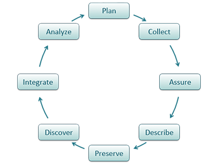
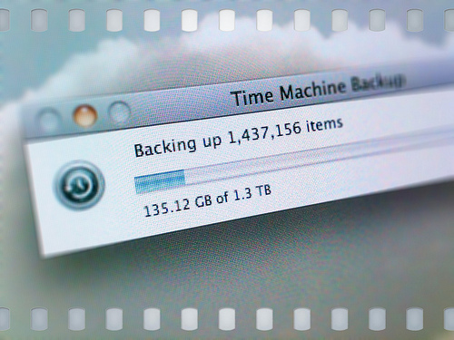
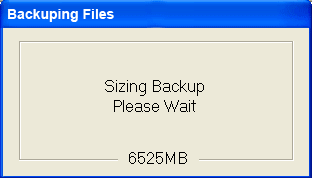

# Lesson Topics
.full-width[* Key Digital Preservation Concepts
* Backups: Things to Consider
* Data Preservation
* Recommended Practices]

???
These slides will cover several topics that relate to data protection.

The first section discusses the differences between three concepts: data protection, backups, and archiving, which are typically associated with digital preservation.  The second section will address why data protection is important. This will be followed by a section on things to consider when handling back-ups and how to deal with issues you may encounter.  The fourth section briefly discusses what data preservation is and what you should consider when dealing with it.  The last section discusses the importance of data backup plans along with recommended practices.

---

# Learning Objectives

After completing this lesson, the participant will be able to:

.full-width[* Define the differences between backups and archiving data
* Identify significant issues related to data backups
* Identify why backup plans are important and how they can fit into larger backup procedures
* Discuss what data preservation covers
* List several recommended practices]

???
By the end of this presentation, you will be able to define the differences between data backups and archives, characterize issues that you might encounter during data backups, and lastly we’ll discuss recommended practices as related to backup plans.
Archives are used to preserve data for historical record and are intended to protect data integrity in case of disaster.

Suggested quiz questions:
Q1: How is archiving data different from backing up data?
Suggested answer: Data backup should occur throughout a research project, and backup files are created for use in the case of loss or corruption of the current version of the data. Archiving is usually only done for final versions of a data file, and archives are created with long-term storage in mind.

Q2: Please describe at least two reasons why a researcher would choose to create data backups.
Suggested answers: 1) Creation of data backups limits or prevents loss of data in the case of accidental deletions, natural disasters, software bugs or hardware failures. 2) Data backups can also save time, money, and productivity by making it easier to respond to requests for data, allowing straightforward reproduction of results of past procedures based on older files. 3) Keeping data backups can also limit liability in cases of lawsuits or inability to reproduce data results

Q3: List at least four issues that should be considered when designing a data backup policy or system.
Suggested answers: 1) existing data backup policies (i.e., policies adopted by the project, office, department, organizational, funding source); 2) how often backups should be created and whether they should be full or partial backups; 3) media for backing up files (e.g., external disk, server, data repository); 4) locations where backups will be stored (including which locations and how many different locations); 5) metadata and organization/labeling systems necessary to retrieve desired backups efficiently; 6) whether backups will be manual or automatic; 7) quality control/quality assurance measures to check backup success and integrity of stored backup files; 8) who will be responsible for backups and serve as the contact person for users who need to retrieve backup files; 9) how outdated data will be disposed of; 10) plan for long-term storage including how long to keep backup files and what happens to backups after the project has ended; 11) designating person responsible for managing policies/workflow of backups, 12) incorporating existing legal requirements for storage and access over time.

Q4: What are some good practices to follow when naming files?  Suggested answers: use consistent file names, use numbers or letters for file versioning, use file names that are descriptive and concise, avoid/rename generic file names

---
# The DataONE Data Life Cycle

???
In this lesson we will be focusing on data protection and backup which is associated with the categories assure and preserve in the data life cycle.  For definitions of the DataONE Data Life Cycle, see: dataone.org/data-life-cycle

---
# Data Protection, Backups, Archiving, Preservation:
Differences at a Glance
.full-width[* Data Protection
  * Includes topics such as: backups, archives, & preservation; also includes physical security, encryption, and others not addressed here
  * More information about these topics can be found in the  “References” section]

???
The terms data protection, data backups, data archiving, and data preservation are often used interchangeably but they do have different meanings and purposes.  Data protection  covers a wide variety of topics including backups, archives, preservation, physical security (such as the use of smart cards), encryption, and others including laws which govern data security.  However, these slides will not focus on this broader topic but rather will look specifically at backups, archives, and data preservation.

---

# Data Protection, Backups, Archiving, Preservation (cont'd)

.full-width[* Terms “backups” and “archives” are often used interchangeably, but do have different meanings
  * Backups: copies of the original file are made before the original is overwritten
  * Archives: preservation of the file
* Data Preservation
  * Includes archiving in addition to processes such as data rescue, data reformatting, data conversion, metadata]

???
The terms data backups and data archiving are often used interchangeably as they both relate to saving a specific version of a file, but they do convey different processes.  The term “backup” is used specifically when making copies of various files with the knowledge that the files may change.  Backups are kept for a certain amount of time, but can be discarded after a specified time has passed.  Archiving is used when a file is to be preserved as-is, often at the end of a project and acts as a static (and usually final) record.

Data preservation encompasses many of these same methodologies, but can also include things like data rescue, reformatting of files, converting data, and the creation of metadata.  These first three topics will be discuss briefly in this lesson; however, metadata will be covered in another lesson.

---

# A Closer Look: Backups vs. Archiving

.full-width[* Backups
  * Used to take periodic snapshots of data in case the current version is destroyed or lost
  * Backups are copies of files stored for short or near-long-term
  * Often performed on a somewhat frequent schedule]

???
The main difference between data backups and archiving is that backups deal with data that is copied elsewhere and potentially can be overwritten again as the data changes.  Archiving makes a record of data that is usually in its final state.

For example, when a user performs a backup, they are in essence taking a snapshot of the data at that moment in time.  This allows the user to restore the file as needed, such as when the current version of the file is corrupted, lost, or somehow destroyed or altered.  Backups could also be used for short-term storage or near long-term storage, depending upon the user’s backup needs and procedures.  Backups are usually scheduled on a frequent basis.

# A Closer Look: Backups vs. Archiving

.full-width[* Archiving
  * Used to preserve data for historical reference or potentially during disasters
  * Archives are usually the final version, stored for long-term, and generally not copied over
  * Often performed at the end of a project or during major milestones
* It is a good idea to have multiple copies of your backups and archives, in multiple places, in case one copy fails.]

???

Archiving deals more with records that could be used to create a historical snapshot of the data. This provides for preservation of the data for future needs.  Usually, archives are made when  a project ends, or when appropriate.

Regardless of whether you are dealing with backups or archives, you should have multiple copies in multiple places in case one (or many) versions fail.

---

# Why Perform Backups?

.two-thirds[
* Limit or negate loss of data, some of which may not be reproducible
* Save time, money, productivity
* Help prepare for disasters
  * Accidental deletions
  * Fires, natural disasters
  * Software bugs, hardware failures
* Reproduce results of past procedures (if they were based on older files)
* Respond to data requests
* Limit liability
]

???
There are many reasons to perform backups including:
 .full-width[* mitigate or prohibit the loss of data, which may or may not be reproducible
 * save time, money, and productivity as little to none of the data will have to be reproduced
 * having a backup already in place means you are prepared for when the unexpected happens, such as human error, disasters, or computer failures
 * allows you to go back to earlier versions and see what your results were.  For example, if you are creating models and used data from an earlier model run, the most recent file you have on your computer may not have the same data as when you first created the model output.
 * provides for the ability to send older files to others, regardless of the current version or state (for example, if the current version has been corrupted)
 * may allow you to respond during times when questioned results were based on older versions of files.  For example, you may find that you will have to justify your results in court or to other scientists.  By having access to older files, you may be able to respond to their requests for information.  Or, you may not be able to reproduce the data, and the original copy may be the only evidence of the data collection.]
 
---

# Backups: Things to Consider

.full-width[* What are the existing policies that might affect how and when you do data backups?
  * May be separate project, office, department, funding source, or organizational polices
    * Policies may differ between groups; which has precedence?
  * Are backups already part of a larger data management or contingency plan for your group?
* Who is responsible for performing backups?
  * Users?  System administrators?  Both?
* Do these various policies fit your needs?]

???
There are certain things to consider when creating backups, especially in the context of overall preservation strategies.
For example:
 * your office or project may have existing policies on when, where, and how  your backups can be performed.  They may already have a backup procedure in place that you can use or build upon.
Policies may differ among groups: for example, your office may perform backups once a month, but your project may need to have the data backed up more often
Policies between research groups may differ as to where the data backups live, and may have different restrictions on accessing the backups
For example:
data backups are often a small part of a good and comprehensive data management plan during the project and overall data stewardship strategy.  Each data management plan should have specific guidelines on backups including when backups are performed, who is responsible for them, how the backups are accessed, where are they located.  By having the answers to these questions, you are better able to manage your data and know who is responsible for various components related to data backups.

Many offices already have backup systems in place, managed by IT staff.  But before you assume backups are being performed for you, you should confirm someone is responsible.  Even if there is a backup system available, it may only cover certain enterprise-wide systems (like servers), and not desktops.  And many offices have little or no IT staff, so performing backups may be solely up to you.
You should identify and review the various policies (if available) and ensure they fit your needs and requirements.  If they don’t, you may need to discuss this with those involved in managing the backups or, establish your own schedule and plan.
You should identify and contact the person(s) in your institution or organization is responsible for overall data stewardship and data management planning.

---

# Backups: Things to Consider; continued

.full-width[* How often should you do backups to capture significant change?
  * Cost versus benefit
  * Continually? Daily? Weekly? Monthly?
* What kind of backups should you perform?
  * Partial: backing up only those files that have changed since the last backup
  * Full: backing-up all files
  * How often and what kind will depend upon what kind of data you have and how unique it is
* What about non-digital files (such as papers)?
  * Consider digitizing files]

???
Other considerations include:
 .full-width[* How often do you want to do backups?  The amount of time between backups depends on several things such as: can you afford to lose weeks worth of data if you only perform backups once a month?  If not, then you should consider doing them more often.  Are you creating real-time data that cannot be reproduced?  If so, you’ll want to consider continual backups.
 * You also need to consider the cost of doing backups versus the benefits.  If you are only occasionally working on a machine and the data isn’t that important, then you probably don’t need a top-of-the-line computer and backup software system which can run you thousands of dollars.  Alternatively, if you are creating files for a multi-million dollar project, you don’t want to be backing up your data by hand to an external drive.]

There are different kinds of backups: partial ones that only back up the data that has changed since the last backup and full backups which backup everything.
Full backups are required when beginning to establish your backups.  They act as a full copy of all of your data.  Then, incremental (partial) backups can be performed which will then backup any data that has changed since the last backup performed.  Since you are only backing up a portion of your system, it is often quicker and requires fewer resources from your computer both in terms of processing and space.
It is still good to do full backups on a regular basis in case a previous full backup is inaccessible or unusable.
Also, you do not want to overwrite the copies of your full backups.  If you were to overwrite a prior copy of a full backup, you may find that the newer copy doesn’t contain the same set of files as the older backup, or, the new file may be corrupted and then you are left without a viable full backup.

How often and what kind of backups you have depend upon how important your data is and what resources you have available.

You should also think about how non-electronic files are backed up.  A disaster damages all files – not just electronic ones.
You may want to consider digitizing non-digital files so that they can be managed by an electronic backup system.  Make sure if you scan in the non-digital files that you scan them at a high DPI so that you do not lose any information.
Even if the information contained in a non-digital file (such as a field notebook) is entered into an electronic system, you may still want to scan in the paper copy so that the format and presentation of the original file is preserved.

---

# Backups: Things to Consider, continued

.full-width[* Where will you backup your files?
  * May depend upon project requirements, etc. 
    * Personal external disk, centralized computer storage (Dropbox), “cloud” storage (Amazon, Google)
      * CDs and DVDs, while cheap and convenient, are not good media for backups
  * What metadata is needed when using these systems?
  * Are the files backed up individually or as one large file?
    * Consider that not all backups may be immediately available, depending on how the files are packaged
  * Good practice to keep backups in different location than source data
    * If a disaster strikes, it can destroy both versions of data]

???
Where you backup your files depends on a variety of things:
 .full-width[* As mentioned, your office or project may have a specific location for where they want the backups to live
 * If you don’t have a backup system in place, you can consider using external drives, online centralized storage such as Dropbox, saving your files to a pre-existing data repository such as GEON or KNB, or using cloud services such as Amazon’s or Google’s.
 * While CDs and DVDs are cheap and frequently used to copy and share data, they have limited shelf-life and therefore are not reliable.
 Some repositories may require some form of metadata in order for you to upload your data.  If you have been creating metadata records during the lifecycle of your project, then this information will be handy and accurate. Metadata should also be created for backup copies.  For more information about creating metadata, see the learning module on “Metadata.”
* Even if you already have one backup in place, you may want to make sure your data is backed up in another location.  If you backup your data to an external drive attached to your desktop computer and there’s a fire in your office, both versions of your data will be destroyed.  Also, there’s no guarantee that your backups are reliable or safe.  Failures can happen on any system.]

---
# Slide title

.full-width[* How are backups carried out?
  * Manually may work for single files, but requires that the user remembers to perform regular backups and can be time-consuming
  * Automated backups can be run on a set schedule that doesn’t require the user to remember
* What do I do if I need to get a file from backups?
  * Backup mode may determine how the file can be retrieved
  * You should know how to obtain files from backups , where they are located, and who to contact
  * You need to know this information beforehand, as often you need a file from a backup in an emergency!
* Understanding the backup process is part of creating good data management practices]

???
In addition to how often you perform backups, you need to also consider how the backups are actually carried out.  If you simply need to back up a few files, you can easily handle that manually.  But if you have many files to backup, or, if you don’t want to have to remember to make the backups, you will want to have a software program that handles it automatically.  
Many computers come with their own backup software, as do external hard drives.

Creating the backups is just part of the process.  You need to know how to get the data off of the backups.  If the files are located locally (for example on an external drive on your machine), then a user will probably be able to access the files.  But if the system is handled by someone else, such as IT staff, there may be restrictions on who can access the files.  If this is the case, do you know how to contact this person?  Do you know who this person is?

If only one member of the IT staff handles this task, and they are unavailable, how will you access your files then?  In addition, some systems create backups that mirror the file structure of the source data.  But some backup systems create one massive file that requires software or programming in order to access files.  Make sure more than one person knows how to perform this task.  Often when you need a file off of backup, it is during an emergency.

---
# Considerations

.full-width[* How do you verify a backup has been successfully performed?
  * Most backup software will have a log file that contains details of the backup (which files, when the backup was created)
  * However, don’t rely solely on the log file 
    * Even if a log file states the backup was successful, you still need to check the backup to make sure the files are there and accessible
    * Test by trying to pull a file off from backup and restore it to another location
    * Hardware and software failures can happen after backups and log files are made
    * Make sure your system is backing up the correct files]

???
In addition to the process being automated, most backup systems will also keep a log of which files were backed up and will perform a validation test to show whether or not the backup was successful.
Even if the log file states the backup was completed, you still need to verify it manually to make sure the files are there, viable, and accessible.
It is a good idea to pick a file off of backup and ensure you can restore it to another location.
Software and hardware failures can happen at any time.  Just because you’ve reviewed your backups once, doesn’t totally guarantee they will be there in the future.
A log file can report a successful backup, but it may be backing up the wrong files!
---

# Considerations

.full-width[* If you are working with someone, such as an IT group, who helps manage and perform backups, confirm and verify that the backup process has been successfully completed
* How do you verify a backup has been successfully performed? 
  * Since manual checks of all of the files in your backup is probably not possible, you should utilize other methods such as checking file sizes, date stamps, and checksum values.
    * Checksum are mathematical calculations based upon a specific file.  If the calculated checksums match between the backup copy and the original file, chances are the file is the same and was not modified when copied or stored.]

???
Since you will probably not be able to manually verify all of the files, you should explore and understand some other methods such as checking and comparing file sizes, file dates, and checksum values.
Checksum values are numeric numbers that are based upon mathematical calculations.  You use a program to calculate the checksum on the original file, then calculate the checksum on the backup copy.  If the values match, then it’s quite likely the files are the same. There are various programs available to calculate checksums on files. 

---

# Considerations

.full-width[* Are there backups of the backups?
  * Necessary for high-value data 
  * Usually different copies of backups are kept in different locations
* How long do you keep your backups?  
  * Depends upon specific situation, and should be determined in concert with stakeholders and resource managers
  * Understand relevant guidelines, policies and rules for retention of data
* What are the long term storage and access solutions that are relevant for the project? What to do when funding ends or key staff depart?
  * Changes in the status of the project, funding, or key staff are important reasons to have a full understanding of related options and requirements for storage and access]

???
As a reminder, you will want to make sure that there are multiple versions of your backups that will also be on different media types and formats.  This is important in the event the primary backups fail.  As an example, a scientist backed up three years’ worth of data onto three separate DVDs.  When he went back later to pull the data off of the disks he found that the glue holding the labels on to the disks had eaten through all of the disks.  All data was lost, even though the scientist had created three copies of the data.

You also want to consider how long to keep your backups.  You may keep full backups for a month, but with incremental backups you may need to do  only once a week.  You may also keep the current backup onsite for a week, but keep the previous three backups offsite, rotating the backups as new ones are made.

Finally, what will happen to backups (or archives) once the project has ended or the funding runs out?  Will your office or program take ownership of the files?

---
# Data in Real Life

A design firm was handling their own backups.  The system was working and the backup software was reporting that the data was successfully backed up. 

---
# Data in Real Life

The administrator checked the backups immediately after they were done and confirmed they were good.

---
# Data in Real Life

After a computer virus erased most of their files, they went back to their backups.  Unfortunately they found that the backups were all blank and all of the data was gone.  Only after some investigation did they discover that the computer tapes (which contained the backups) were placed against a wall that had an elevator on the other side of it.  When the elevator went past, the magnets inside erased all of the tapes.
* Had they checked their backups properly, they probably would have noticed this before there was an emergency

???
Unfortunately their computer system became infected with a virus and erased much of their data.  They went back to their backups and found that the backups were all blank and all of the data was gone.  Only after some investigation did they discover that the computer tapes (which contained the backups) were placed against a wall that had an elevator on the other side of it.  When the elevator went past, the magnets inside erased all of the tapes.  Had they checked their backups properly, they probably would have noticed this before there was an emergency.

---
# Final Considerations

.full-width[* Can you read data from older backups?
  * Media changes. You may no longer be able to  read older versions and formats such as floppy disks, Jazz  and Zip drives, WordPerfect files, etc.
* Media can degrade quickly, unexpectedly, inconsistently
  * Even if you can open a file today, that doesn’t mean you can in a month from now
* How will you dispose of outdated data?
  * Make decision to copy, archive
Remember: back up the data you can’t afford to lose!]

???
Another issue with backups is that they may be stored on older hardware or formats that can no longer be read.  For example, if you have data that was backed up on floppy disk, or created by a backup software program that no longer exists, how will you access the data?  Even if you are using a common software program, such as Microsoft Excel, you may find that older versions of the program created file formats that can no longer be opened by current versions of the same software.  When new software versions come out, early on you can usually use the software to convert the files into newer versions, but for older files there may be no option for this if too much time has passed.

As mentioned earlier, even if you use currently-available media (such as DVDs or external drives), they are not immune to degradation.  DVDs and hard drives are notorious for their unexpected failures. There may be little or no warning that your backup media may be about to fail or has already failed.  This is another reason to check your backups on a regular basis.

You will also want to consider what will happen to older backups.  Do you want to keep storing them?  Should they be archived?  Should they be destroyed, and if so, how will you handle that?  If you are dealing with sensitive information, make sure you are using a reliable system that will completely destroy old files.  Simply deleting a file off of a computer or reformatting a hard drive does not completely prevent someone from accessing that information again.  Special software may be needed to accomplish permanent deletion.  

How long  you keep your backups are up to you and your specific circumstance.  But generally it’s best to keep backups for weeks to months, as often you don’t find you need a file off of a backup until weeks after the fact.

A good rule of thumb is: only backup the data you can’t afford to lose.  For many of us, that is the majority of our files.

---

# Data Preservation

.full-width[* By managing and preserving your data well, data rescue may not be necessary.  Why? 
  * Addition of relevant metadata, proper file naming (can help the file from getting lost in the system), utilization of proper file formats (lets you open the file without having to convert the file), backups (limits loss of files), and media types (limits degradation of files), you may limit or prevent the need for data rescue.
* A good data management plan is another tool to help limit the need for data rescue.]

???
If data is well-preserved, then data rescue may not be necessary. With proper file naming (can help the file from getting lost in the system), utilization of proper file formats (lets you open the file without having to convert the file), backups (limits loss of files), and media types (limits degradation of files), you may limit or prevent the need for data rescue.  A good data management plan, which is discussed in another lesson, is another important tool in limiting the need for data rescue.

---

# Processes Related to Data Preservation

.full-width[* Includes backups and archiving in addition to processes such as data conversion, data reformatting, and data rescue
  * Older files may no longer be in a usable format and may require conversion or “rescue” before the data can be used.
  * Data reformatting, conversion, and backup becomes even more important as projects finish up and/or are no longer funded.  
  * Data may have been kept at the end of the project, but if no one is managing the data, data may be left in formats that are no longer usable or in locations that are no longer accessible.
* Additionally, data preservation requires planning, structure, and ongoing management and assessment]

???
Our last topic covers Data Preservation.  Data preservation is a comprehensive topic on its own, which includes things such as backups, archives, data conversion, reformatting, and rescue.
 “Data rescue” deals directly with older files that may no longer be in a format that is easily accessible and will require some “rescuing” before it can be used again
 Data rescue becomes more and more important as projects end.  Even if data was being preserved through the lifetime of the project, often files go untouched or orphaned.  Frequently, data has not been managed properly, and requires that some form of data rescue be performed so that the data isn’t a total loss.
 
---

# Preservation Formats and Version Strategies

.full-width[* Create useful, relevant metadata
* Data Conversions and Formats
  * Use non-proprietary, standard formats
  * Convert text files from .doc or .xls to .txt, image files to .tiff or .pdf
  * Be sure to check files after converting them, as data, metadata, and formatting loss can occur
* Versioning
  * Use consecutive numbers and letters to help keep track of changes to a file throughout various edits and revisions.  This will help you quickly differentiate between files with similar names.
* File Naming
  * Use file names that are consistent, descriptive, and concise so that you can find and quickly identify the file the file at a later time.
  * Rename files that have a default file name when exported such as “image.jpg” or “archive.zip”]

???
When preserving your data, you need to consider many things:
 Data formats: it is best to use non-proprietary and standardized formats.  This will better ensure readability in the future.  Use formats such as .txt or .pdf.
 Versioning: make sure to use some sort of naming convention (such as incremental letters or numbers) to help keep track of file edits and revisions.  This will also help you more quickly locate the correct version of a specific file.
 Naming: use file names that are consistent, descriptive, and concise.  Many software programs use a generic file name as their default file output and usually these names are too general to be useful.
 
---

# Recommended Practices

.full-width[* Create a preservation policy that clearly identifies:
  * roles
  * responsibilities
  * where the data is backed up
  * how often the files are backed up
  * how to access the files
  * recommended file formats to be used
  * policies for migrating data to assure data are not lost due to media degradation or changing formats or programs
* Review your preservation policy and plan periodically to ensure it is still valid and applicable]

???
The first best practice is to create a backup policy.  This may be a physical document, a web page, or listed as someone’s job description.  Regardless of how you create it, it’s important to address any of the previously mentioned issues and concerns. For example, who do I contact when I need to get a file off of backup?

Once you have a backup policy in place, it is good practice to review it periodically to ensure the information still has value and is applicable.  Hardware, software, projects, and staff can change over time.

Handling backups without the assistance of software or specifically-tasked staff can often lead to problems.  It’s hard to remember to do backups as often as you should without the assistance of a reminder or pre-existing schedule.  Different users may handle their backups differently if performing them manually.  If there is an enterprise-wide system in place, it takes away most of the issues associated with user error and ensures everyone’s data is being backed up consistently.
  Larger projects and offices will probably want to have specific IT staff tasked to handle backups.  They are more likely to keep updated with current best practices.  However, some offices may have little or no IT support, so ensuring that proper backups are being performed may be left up to you.

---

# Recommended Practices, continued

.full-width[* Minimize or remove reliance on users to perform own manual backups (if possible)
  * Implement standardized and automatic backups
  * If possible, put experts in charge of this task (computer staff) as they are more likely to keep up-to-date regarding software updates, hardware issues, best practices, etc.
* Don’t assume backups are being performed for you
  * You don’t want to find out after the fact that no backups have been performed
  * If you are using third-party software (like Yahoo or Google Mail), what happens if they lose your files?
* Use non-proprietary, standard formats
  * Convert text files from .doc or .xls to .txt, image files to .tiff, or .pdf]

???
If possible, do not rely upon manual backups.  Utilizing an automated system will probably be faster and do a better job of saving your files.  If available, have your IT or support staff help you with your backups.  Again, do not assume that backups are being handled for you.  Even if someone else is handling them, make sure the backups are tested.  In addition, if you are relying upon third-party systems, they may or may not be handling backups on their end.  Lastly, to ensure future readability, use non-proprietary, standard formats.

---

# Recommended Practices, continued

.full-width[* Check your backups manually
  * Start with log files, as they may tell you the backup was unsuccessful
  * Do not rely solely on the log files – they may be incorrect or the data may have become corrupted after the file was transferred
  * Look at file dates and file sizes to see if they match; calculate a checksum on the original and archived file and make sure they match
  * Ensure you can read files off of older backups and archives.
* Have multiple versions of backups on multiple formats in multiple places
* Good data management will limit the amount of data rescue that needs to be performed on older data]

???
Again, do not assume that backups are being handled for you.  Even if someone else is handling them, make sure the backups are tested.  In addition, if you are relying upon third-party systems, they may or may not be handling backups on their end.  Make sure the files backed up match the source files.

Have multiple versions in multiple places.  For example, have a backup that goes to an external drive in your office and another one that is copied on to a tape drive and stored off-site.

By following the recommendations in these lessons, you limit the need for data rescue of older files.

---

# Data in Real Life

In 2011, a software bug caused some Gmail users to lose access to their email.  Fortunately, Google had backups! 

???
Again, do not assume that backups are being handled for you.  Even if someone else is handling them, make sure the backups are tested.  In addition, if you are relying upon third-party systems, they may or may not be handling backups on their end.

---

# Summary

.full-width[* Data preservation is more than just backing up and archiving your files
  * organizational infrastructure, technological situation, resources
* When devising a preservation strategy, one needs to consider how often to perform backups, where to backup, accessibility to backups and how long to keep the files
* There are many reasons we need to perform backups, primarily to prevent data loss
* Check for backups on outdated media and test your backups often!] 

???
Backups refer to creating copies of original files while archives involve the preservation of files
There are many reasons we need to perform backups but primarily to prevent data loss
One needs to consider how often to perform backups, where to backup, and accessibility to backups when you need them and how long to keep the files
Check for backups on outdated media and test backups often! 
Data preservation more than just backing up and archiving your files.

---
# References

1. Stanford University Libraries, Data Management Plans, (Stanford University Libraries), https://library.stanford.edu/research/data-management-services, (accessed 9/21/2016)
2. Albanesius, Chloe, Google: Storage software update led to e-mail bug, http://www.pcmag.com/article2/0,2817,2381168,00.asp (accessed 09/21/2016)
3. Van den Eynden, Veerle, Corti, Louise, Woollard, Matthew, Bishop, Libby and Horton, Laurence, Managing and Sharing Data, http://www.data-archive.ac.uk/media/2894/managingsharing.pdf , and companion materials, https://www.ukdataservice.ac.uk/manage-data/handbook (accessed 09/21/2016)

For more information about physical security, encryption, and data disposal, visit:  http://www.data-archive.ac.uk/media/2894/managingsharing.pdf

---
# About
Participate in our GitHub repo: [https://dataoneorg.github.io/dataone_lessons/](https://dataoneorg.github.io/dataone_lessons/)

The full slide deck (in PowerPoint) may be downloaded from:
[http://www.dataone.org/education-modules](http://www.dataone.org/education-modules)

**Suggested citation:**
DataONE Education Module: Data Management. DataONE. Retrieved November 12, 2016. From [http://www.dataone.org/sites/all/documents/L01_DataManagement.pptx](http://www.dataone.org/sites/all/documents/L01_DataManagement.pptx)

**Copyright license information:**
No rights reserved; you may enhance and reuse for your own purposes.  We do ask that you provide appropriate citation and attribution to DataONE.

---

