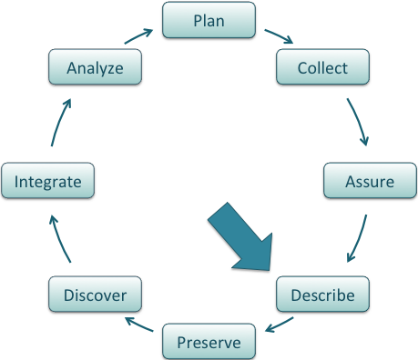
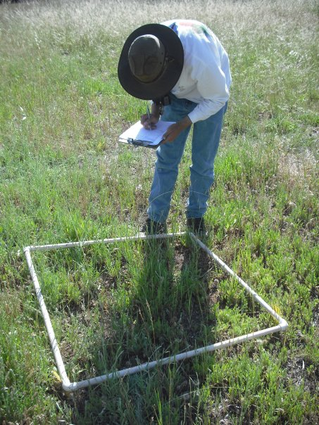
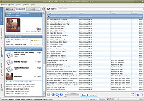
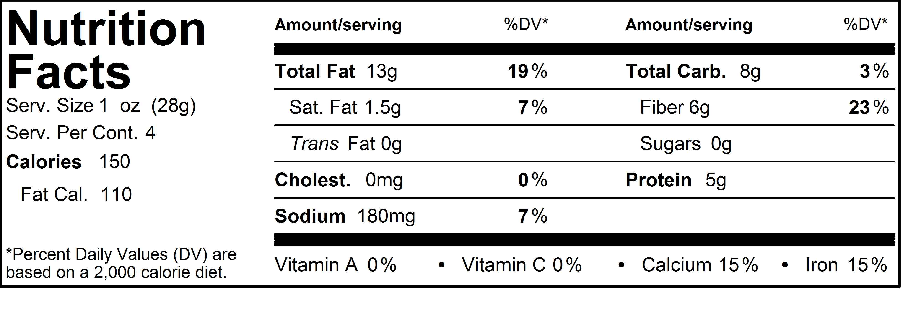
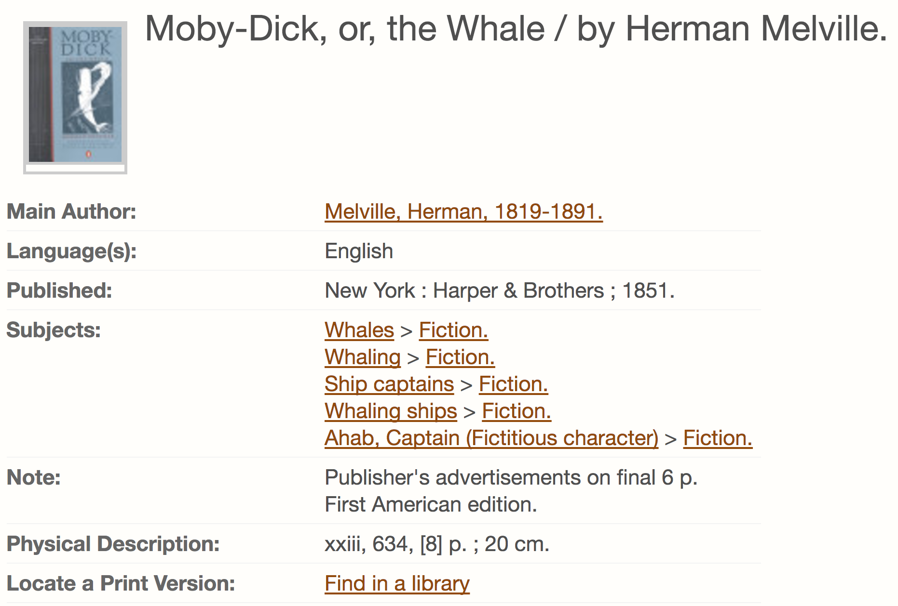
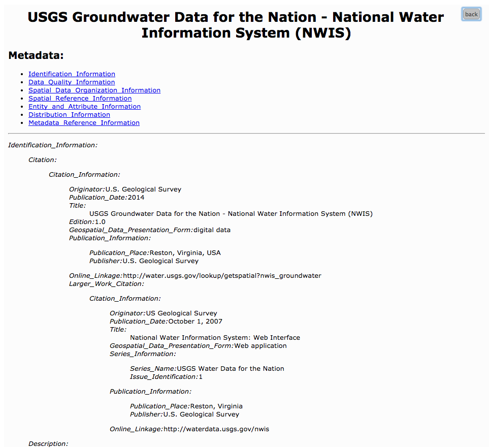
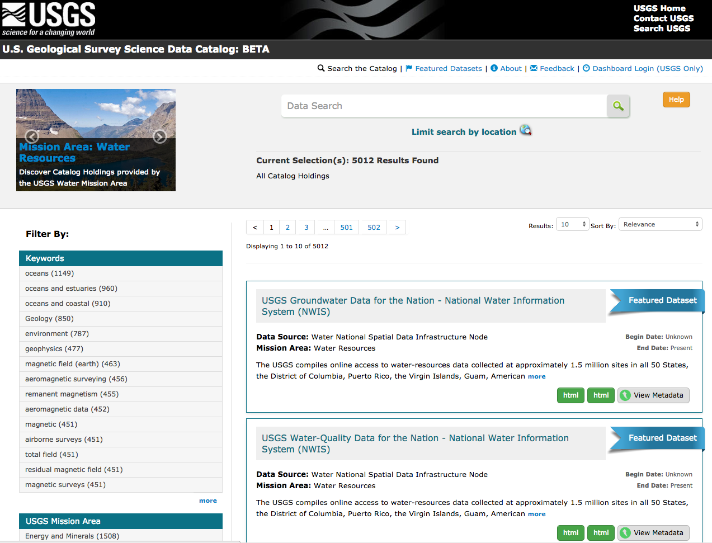
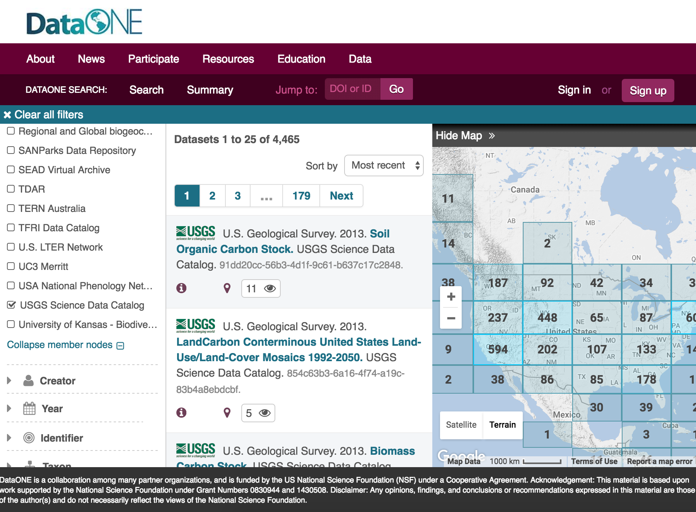
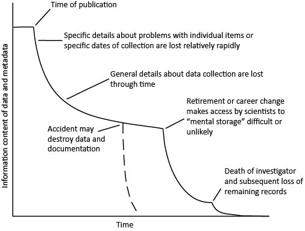

class: center, middle

# Tutorials on Data Management
## Lesson 7: Metadata

  *Image Attribution: CC image by bonus on Flickr*

---

# Lesson Topics

.full-width[- Explanation of metadata
- Illustrate the value and utility of metadata to data users, data providers, and organizations
- Examine information included in a metadata record
- Examples of metadata standards and how to choose
- Preparing to write metadata 
- Tips for writing a quality metadata record
]

 
	.caption[Photo Attribution: CC image by Alec Couros on Flickr]

	
???

In this segment of the course we will cover:
What is metadata?
What are examples of metadata in our daily lives? 
And what information needs to be included in a metadata record?

---

# Learning Objectives

After completing this lesson, the participant will be able to: 

.full-width[- Identify & list the types of **information typically included in metadata records** for environmental datasets
- Identify 3 **reasons metadata is of value** to data users, data developers, and organizations
- List 3 **uses for metadata**, beyond discovery of data
- Identify and describe factors that may determine which **metadata standards** are most appropriate for a given dataset
- List **steps to prepare** to write metadata
- Explain how to **write good metadata**
]

---

class: center, middle

# The Data Life Cycle

???

Writing metadata falls within the “Describe” portion of the Data Life Cycle.

---

# What is metadata?

.two-third[**Metadata is: Data ‘reporting’**

- **WHO** created the data?
- **WHAT** is the content of the data?
- **WHEN** were the data created?
- **WHERE** is it geographically?
- **HOW** were the data developed?
- **WHY** were the data developed?
]

.one-third[
  *Photo Attribution: Photo by Michelle Chang. All Rights Reserved*
]

???

Metadata is data about data. It describes the content, quality, condition, and other characteristics of a dataset.  

Metadata records answer questions such as:
	Why was the dataset created?
	What processes were used to create the dataset?
	What projection are the data in?
	When were the data last updated?
	Who created the data?
	What scale was used?
	What fields are in the table?
	What do the values in those fields mean?
	Who do I contact about getting more information about the data?
	How do I obtain a copy of the data?
	Do the data cost anything?
	Are there any limitations to the data?

Metadata is a valuable tool. Metadata records preserve the usefulness of data over time by detailing methods for data collection and dataset creation. Metadata greatly minimizes duplication of effort in the collection of expensive digital data and fosters the sharing of digital data resources. 

---

# Metadata in Real Life

Metadata is all around...

.one-half[
*CC image by Mskadu on Flickr*

*CC image by USDAgov on Flickr*

]

.one-half[
*Hathi Trust*
]
  
???

Metadata is all around us. . .from Mp3 players, to nutrition labels, to library card catalogues.
For example, a card catalogue tell us more information than just the title of the book, they also tells the user:
- Who is the author?
- Who published the book?
- What subject area does the book fall in?
- And finally, where is it located in the library? 

Another example of metadata that we see in our daily lives is the nutrition and ingredient information on food labels.
Nutrition labels answer questions such as: 
- What ingredients were used?
- Who made the food?
- How many calories per serving?
- How many servings in the can?
- What percentage of daily vitamins are in each serving?

---

# Metadata: What are they good for?

.one-third[
Metadata: captures information
]

.one-third[
USGS Science Data Catalog: enabling discovery
]

.one-third[
DataONE: enables exchange
]

???

Metadata are essential for capturing information and data discovery. For example, a metadata record submitted to a catalog, such as the USGS Science Data Catalog, enables discovery of data; subsequently, the same metadata can be exchanged with broader data catalogs with services such as DataONE. 

Elements such as Title, Description, and Keywords enable users to discover data based on topical searches. Spatial and temporal elements allow users to discover data based on the geographical location or the time period of the data. 

---
class: center, middle

# Metadata: Why are they important?

<footer>Michener, W. K., Brunt, J. W., Helly, J. J., Kirchner, T. B. and Stafford, S. G. (1997), NONGEOSPATIAL METADATA FOR THE ECOLOGICAL SCIENCES. Ecological Applications, 7: 330–342. doi:10.1890/1051-0761(1997)007[0330:NMFTES]2.0.CO;2]</footer>

???

Metadata are also very important for understanding and reusing scientific data. At the time of data development, scientists know the most about their dataset and the steps that were taken to create it. Over time, memory of the details begins to fade. Circumstances in life can intervene, and eventually the knowledge about the dataset is gone. Without a metadata record, information about the dataset could be lost forever, therefore, making the data unusable. 

This graph illustrates the phenomenon of “information entropy”, associated with research. At the time of the research project, a scientists memory is fresh. Details about the development of the dataset are easily recalled, and it is a good time to document information about the process. Over time, memory of the details begins to fade. A variety of circumstances can intervene, and eventually detailed knowledge about the dataset fades. Without a metadata record, this data might be unusable. A dataset it not considered complete without a metadata record to accompany it.  

---

# Metadata: Why are they important?

.full-width[Policy decisions based on data can only be defended if the metadata are good quality
- Regulatory decisions based on undocumented data are not defensible
- Metadata accuracy and details are important as supporting evidence for the science and policy
]

Controversies arise when metadata are incomplete and/or absent

???

Regulatory agencies depend on metadata to defend the science behind decisions. If regulatory decisions are based on data that have no associated metadata or poor quality metadata, those decisions will not hold up in court. It is important to have accurate and detailed metadata records for supporting claims and policies. For example, the date when data are collected should be as specific as possible. In many situations, simply including the year that data were collected may not be sufficient. 

Controversies can arise when metadata are incomplete or absent. For example, the USGS is the research arm of the Department of the Interior (DOI). They are tasked with providing sound and unbiased data, and data interpretation, for resource management decisions made by their sister agencies in the Department. Those decisions can be controversial and often, they are challenged in court. The data used to make those management decisions must be sufficiently documented so as to be transparent and reproducible to a third party attempting to connect the dots and reach a similar conclusion. If USGS data lack sufficient documentation, they cannot be used towards decision making.

It is difficult to find real-world examples of the costs of poor metadata. Agencies don’t like to admit these shortcomings; however, Tom Chatfield, a data management expert with the Bureau of Land Management (BLM) bravely shared one real example from his own agency. A particular BLM field office developed an overall resource management plan for its region which included a map of oil and gas potential for its area. Naturally, this is an issue that registers strong opinions both for and against oil and gas recovery on public lands. When reviewed in the advent of litigation, BLM discovered that no Data Quality information existed for the map. No data sources could be identified, nor was there any discussion of the analysis methodology by which the oil and gas potential information was developed for the map. No geologic or geographic data were identified.

This was potentially disastrous in terms of defending the resource management plan. BLM was forced to develop a brand new map and closely document the provenance of the source data and methodology used to determine the potential ratings on the map. The cost exceeded several thousands of dollars in staff time and production costs, not to mention the intangible costs of loss of trust in the agency by partners and the public.

---

# The Value of Metadata

Rebuild Cycle Graphic manually

???

Metadata is useful to Data users, Data creators, and Organizations. In this era of data sharing, collaboration, and need for information organization, metadata can serve multiple purposes. 

---

# What is the Value to Scientists, Researchers, and other Data Creators?

.full-width[Metadata allows data developers to:
- Avoid data duplication 
- Share reliable information
- Publicize efforts – promote the work of a scientist  and his/her contributions to a field of study 
- Metadata reuse saves time and resources in the long-run
]

  *CC image by US Embassy Guyana on Flickr*

???

What value does metadata have to Scientists, Researchers, and other Data Creators?
Metadata records will help avoid data duplication because researchers can determine if data already exist. Scientists are able to share reliable information about a dataset by creating metadata and passing it along with the dataset. Scientists wishing to reuse a dataset can be confident of its origins, data quality, and other valuable information about the data. Metadata also allow data creators to publicize the valuable data they have collected by making the metadata available on clearinghouses and other publically available venues. Metadata can be used in citation practices, thus increasing the visibility of the data. 

---

# What is the Value to Data Users?

.two-third[Metadata gives a user the ability to:
- **Search, retrieve, and evaluate** dataset information from both inside and outside an organization
- **Find data**: Determine what data exists for a geographic location and/or topic
- **Determine applicability**: Decide if a dataset meets a particular need
- **Discover** how to acquire the dataset identified; process and use the dataset
- **Understand** the dataset, including definitions of column names, or expected numerical ranges found in the data
]

.one-third[
*CC image by ASEE on Flickr*
]

???

Metadata allows the user to search for and access data from a variety of sources. A search for metadata can be constricted to a geographic boundary, thus showing the user what data has been collected in a particular region. Metadata records help users determine whether the data will be applicable for use in a particular study. Finally, metadata records are of value to data users because they determine how a dataset can be acquired, and if there are any restrictions on how the data can be used. 

---

# What is the Value to Organizations?

.two-third[Metadata helps ensure an organization’s investment in data: 
- Documentation of data processing steps, quality control, definitions, data uses, and restrictions
- Ability to use data after initial intended purpose
- Allows organization to track data use and facilitates publication
Transcends people and time: 
- Offers data permanence
- Creates institutional memory
Advertises an organization’s research: 
- Creates possible new partnerships and collaborations through data sharing
]

.one-third[
*CC image by mambol on Flickr*
]

???

An organization that keeps current metadata can benefit in many ways. Metadata records help ensure the organization’s investment in the data by retaining information about how the data was collected, processed, and quality controlled. This creates a permanent record of the dataset –which is critical institutional memory. When researchers leave or retire, metadata allows the dataset to “live on” for the organization. The data may be reused in another research project in the future, and future researchers in the organization will need to know how the dataset was created.  Finally, metadata advertises an organization’s research, creating new potential partnerships and collaboration through data sharing. 

---

# The Utility of Metadata

Metadata can support:
- data distribution (discovery, catalogs)
- data management (provenance, accountability, liability)

???

Metadata is beneficial because it can be used to support data distribution, data management, and project management. To be best utilized, metadata should be considered a component of the data, created during the development of the data, and populated with rich content. 

---

# Data Distribution: Discovery

The descriptive content of the metadata file can be used to identify, assess, and access available data resources.

Rebuild graphic manually.

???

Metadata serves data discovery at multiple levels:
- initial identification by query of keywords, location, time, and attributes
- a quick assessment can be made by the scientist as to how useful the data are for a project by reading the access and use constraints; data quality measures of positional and attribute accuracy and sources used; and statements as to data availability, format and pricing
- a user can find out how to access the by reading access instructions, any standard order process instructions, and contact information for the dataset.

---

# Data Distribution: Catalogs

.two-third[Examples of metadata search catalogs:

DataONE
- Data discovery, knowledge, community…for a sustainable future
- https://search.dataone.org
Data.gov
- Federal e-gov geospatial data portal
- http://www.geo.data.gov
Metacat
- Repository for data and metadata		
- http://knb.ecoinformatics.org/index.jsp
US Geological Survey
- USGS Science Data Catalog
- http://data.usgs.gov/datacatalog
ArcGIS Online
- ESRI sponsored national geospatial data portal
- http://www.geographynetwork.com
]

.one-third[
*CC image by --- on Flickr*
]

???

Data portals are plentiful, and contain easily accessible metadata collections from a variety of institutions. 

---

# Data Distribution Example: DataONE

Three DataONE Search images

???

DataONE is an example of a metadata repository, available to all researchers. 

---

# Data Management: Provenance

.full-width[Metadata records can be used to track data provenance accurately
- Are the data current?
- Are the data in a reliable format?
- Where are the data stored? 
- Contact information
- Distribution policies, availability, pricing, URLs
- New derivations of the dataset
]
???

For data management, metadata records can be queried to determine:
do we have data older than 10 years?
do we have data that was before some political or geophysical event resulted in significant change?
do we have data that used some older or now invalid data as a source?
do we have data that used older or now invalid methods?
Are the data still stored where the metadata indicates? 

Global edits to contacts, policies, URLS, and information about new derivations of the dataset can be included in metadata records, thus assisting the data management process. 

---

# Data Management: Accountability
.full-width[Metadata allows you to repeat a scientific process if:
- methodologies are defined
- variables are defined
- analytical parameters are defined

Metadata allows you to defend your scientific process:
- process is documented
- increasingly data savvy public requires metadata for consumer information
]

???

Metadata allows you to repeat a scientific process (reproducibility) if methodologies, variables, and  analytical parameters are well defined. It allows you to defend and demonstrate scientific process.  A defensible process enables you to demonstrate the methodologies that led to decisions using the data. Increasingly, the savvy public demand metadata with datasets for consumer information purposes.

---

# Data Management: Liability

.full-width[Metadata is a declaration of:
- Purpose – the originator’s intended application of the data
- Use Constraints - inappropriate applications of the data
- Completeness - features or geographies excluded from the data
- Distribution Liability - explicit liability of the data producer and assumed liability of the consumer
]

???

Metadata is invaluable for data liability. For example, a record will indicate the purpose – why the data were collected, any use constraints that are associated with the data, how complete the dataset is, and who is liable once the data are distributed and reused.

---

# Concerns About Creating Metadata (1)

Even if the value of data documentation is recognized, researchers are often concerned about the effort required to create metadata that effectively describe their data.

File Folder Image 
  *CC image by waterlilysage on Flickr*

???

Even if the value of data documentation is recognized, concerns remain as to the effort required (i.e. time) to create metadata that effectively describes the data. 

---

# Concerns About Creating Metadata (2)

| Concern | Solution |
|:----------|:----------|
| Workload required to capture accurate robust metadata | Incorporate metadata creation into data development process – distribute the effort |
| Time and resources to create, manage, and maintain metadata | Include in grant budget and schedule |
| Readability / usability of metadata | Use a standardized metadata format |
| Discipline specific information and ontologies | Use a standard ‘profile’ that supports discipline specific information | 

???

Metadata does require time and effort to create. The workload, however, is reduced when metadata creation is incorporated into the data development process and the effort is distributed among data contributors. Metadata creation and management should be treated as a standard data development procedure and resources for staff and time should be included in project and proposal work plans and budgets. The use of a standardized metadata format and the development of discipline specific ‘profiles’ of metadata can enable data users to quickly find needed information and address data developer concerns about metadata use and comprehension. 

Definition of a profile: http://support.esri.com/other-resources/gis-dictionary/term/metadata%20profile 

“A modification of an existing metadata standard to adapt to data issues, cultural issues, or both. A profile is typically a subset of a base standard that tailors the metadata elements in the base standard to better describe the data to the community that uses it. Metadata profiles allow communities to follow a metadata standard, while at the same time enhancing the standard so that it is more appropriate for a particular use or locale.

---

# What is a Metadata Standard?

.full-widht[A Standard provides a structure to describe data with:
- Common terms to allow consistency between records
- Common definitions for easier interpretation
- Common language for ease of communication
- Common structure to quickly locate information

In search and retrieval, standards provide:
- Documentation structure in a reliable and predictable format for computer interpretation
- A uniform summary description of the dataset
]

File Folder Image 
  *CC image by waterlilysage on Flickr*

???

An established standard provides common terms, definitions, and structure that allow for consistent communication. The use of standards also supports search and retrieval in automated systems.  

---

# What does a metadata standard include?

.full-width[Components of metadata: 
- A metadata standard is made up of defined *elements*, including the type of information the user should enter (e.g. text, numbers, date). 
- Examples of elements include: title, abstract, keywords, persistent link, variables, units, usage rights
]

**needs image** 

???

An established standard provides common terms, definitions and structure that allow for consistent communication. The use of standards also support search and retrieval in automated systems. 

Image: an example of a metadata editor in ArcGIS where entity and attribute information may be entered to generate a metadata record (source: http://desktop.arcgis.com/en/arcmap/10.3/manage-data/metadata/illustrated-guide-to-complete-fgdc-metadata.htm#ESRI_SECTION1_01B7AC211E2040F9A436CA03D6A0E094)

---

# What does a metadata record look like?

Metadata from the Santa Barbara Channel LTER program in kelp forest ecology
<footer>This is the descriptive metadata. Notice tabs for other, more granular use metadata</footer>

.one-half[
  ]
  
.one-half[
  ]

???
  
This is an example of a metadata record using the Ecological Metadata Standard (EML) schema. 

---
  
# Choosing Metadata Standards
  
Arrows Image 
*Image courtesy of Viv Hutchinson*

---

# Multiple Metadata Standards Exist: Examples (1)

.full-width[Dublin Core Element Set
- Emphasis on web resources, publications
- http://dublincore.org/documents/dces/

FGDC Content Standard for Digital Geospatial Metadata (CSDGM)
- Emphasis on geospatial data
- The Biological Data Profile (BDP) of the CSDGM is a profile to the CSDGM with an emphasis on biological data (and geospatial)
- https://www.fgdc.gov/metadata/csdgm-standard

ISO 19115/19139  Geographic information – metadata 
- Emphasis on geospatial data and services
- https://www.fgdc.gov/metadata/iso-standards
]

???

There are many standards available to document data. Each has a different focus, yet asks for similar information about the dataset. 

---

# Multiple Metadata Standards Exist: Examples (2)
  
.full-width[Ecological Metadata Language (EML)
- Focus on ecological data
- http://knb.ecoinformatics.org/eml_metadata_guide.html

Darwin Core
- Emphasis on museum specimens
- http://rs.tdwg.org/dwc/index.htm

Geography Markup Language (GML)
- Emphasis on geographic features (roads, highways, bridges)
- http://www.opengeospatial.org/standards/gml
]
???

There are many standards available to document data. Each has a different focus, yet asks for similar information about the dataset. 

---

# Comparing Metadata Standards

Terminology for the same concepts may vary across standards

| Ecological Metadata Language (EML) | FGDC Content Standard for Digital Geospatial Metadata |
|:----------|:----------|
| Title | Title |
| Abstract | Abstract | 
| Entity Description | Entity Type Definition |
| Intellectual Rights | Use Constraints | 

---

# Choosing a Metadata Standard: Factors (1)

.full-width[**Your data type**
- Are you working mainly with GIS data? Raster/vector or point data? Do you have biological or shoreline information in your dataset?
  - Consider the FGDC Content Standard for Digital Geospatial Metadata with one of its profiles: the Biological Data Profile or the Shoreline Data Profile. 
- Are you working with data retrieved from instruments such as monitoring stations or satellites? Are you using geospatial data services such as applications for web-mapping applications or data modeling?
  - If so, then consider using the ISO 19115-2 standard
- Are you mainly working with ecological data?
  - Consider Ecological Metadata Language (EML) 
  ]    

---

# Choosing a Metadata Standard: Factors (2)

.full-width[**Your organization’s policies**
 
- Do they state which standard to use? 
- What resources are available to create metadata? 

>Examples of Tools:
- FGDC CSDGM: https://www.fgdc.gov/metadata/geospatial-metadata-tools#availabletools 
- EML: Morpho http://knb.ecoinformatics.org/morphoportal.jsp
- ISO: http://www.fgdc.gov/metadata/iso-metadata-editor-review
- XML: Spy or Oxygen
- CatMD

**Other factors**: Availability of human support; instructional materials; use of controlled vocabularies; output formats
]

---

# What Makes a Good Metadata Record?

Metadata are developed continuously throughout the entire data lifecycle

Lifecycle Image 

???

Now that you know about some metadata standards to use and some available tools for developing metadata, let’s discuss some aspects of a good metadata record. 

As mentioned at the beginning of this module, metadata should be developed continuously throughout the entire data lifecycle. This means that metadata should be generated along-side the data. Starting early will ensure that information about your data is fresh in your mind, which in turn saves you time. It will also enable you to provide more details about your data, which in turn leads to a higher-quality metadata record. For example, writing the Entity & Attributes section of your metadata or creating a separate data dictionary while you are developing your database will reduce this burden at the end of the project and can serve as a helpful tool during the project to ensure that everyone understands what each of the entities and attributes means. Writing the processing section of your metadata when you are processing your data ensures that all processing steps are documented. It is most beneficial if the person who is completing the data processing is the same person who writes the processing section for the metadata record. 

---

# What Makes a Good Metadata Record?

Consistency with commonly used fields
Here are some examples for a FGDC CSDGM record:

| Field  | DO THIS | NOT THIS | 
|:----------|:----------|:----------|
| Publisher | `<publish>U.S. Geological Survey</publish>` | `<publish>USGS</publish>` |
| Date | `<pubdate>YYYYMMDD</pubdate>`   `<pubdate>YYYY</pubdate>` | `<pubdate>MM/DD/YYYY</pubdate>`   `<pubdate>May 27, 2003</pubdate>` |
| Keywords | `<placekt>Geographic Names Information System</placekt>`   `<placekey>Roosevelt National Forest</placekey>` | `<themekey>Roosevelt Forest</themekey>` | 

`<publish>U.S. Geological Survey</publish>`

???

As you get started developing your metadata record, it is important that certain fields are used consistently. This means that some metadata fields require values that are written the same way to aid in machine-readability and discovery. For example, the publisher field should contain the standard form of your agency’s or organization’s name (if that is the appropriate publisher). For example, the USGS, the name should be written as U.S. Geological Survey, not USGS. 

For CSDGM records, all dates should be written using the format of four digits for year, then two digits for month, followed by two digits for the day (YYYYMMDD). Data.gov is enforcing this format and metadata will fail validation if other formats are used. 

Select the keywords that are specific to your dataset. The thesaurus used should be documented in the metadata. If a single thesaurus does not provide all of the theme keywords that your metadata require, you may use and reference more than one thesaurus. Within FGDC CSDGM and ISO 19115 there are specific fields for place keywords. The theme keyword field should not be used for place keywords. A good resource for finding standard place keywords is the Geographic Names Information System. 

If you need to include species names in your metadata, you may use the taxonomic section within the Biological Data Profile instead of the theme keyword fields, to do so. 

Refer to the appropriate documentation and/or schema for the standard you are using, as well as with your agency/organization to ensure you following the recommended usage.

---

# What Makes a Good Metadata Record?

Use Authority Files and Standard Vocabulary
.one-half[
- Global Change Master Directory
- Geographic Names Information System
- Getty Thesaurus of Geographic Names
- ISO 19115 Topic Category Thesaurus
]

.one-half[
*Photo Attribution: Photo by mxgirl2014. All Rights Reserved*
]

???

When possible, theme keywords should be drawn from thesauri or keyword lists. The use of authority files and standard vocabulary will help to make your metadata more discoverable, understandable, and interoperable. Make sure you reference the thesaurus used in your metadata record. Here are a few resources to get you started.

---

# What Makes a Good Metadata Record?

.one-half[**Acronyms**
- Spell out acronyms with first use. Many acronyms have multiple meanings (e.g., DOI)
- Use widely known acronyms only when it corresponds to specific metadata fields such as file formats (e.g., TIFF, JPEG, PDF)
]

.one-half[
*Photo Attribution: Photo by Michelle Chang. All Rights Reserved*
]

???

If your metadata include acronyms, you should spell out the acronyms with their first use. Many acronyms have multiple meanings and, therefore, need to be clarified. DOI is an example of an acronym with multiple meanings. It is used for the Department of the Interior & Digital Object Identifiers. The use of widely known acronyms for file formats is acceptable without first spelling them out. For example, TIFF, JPEG, & PDF are all widely known across disciplines as different file types and would be acceptable to use. 

---

# What Makes a Good Metadata Record?

Provide all of the critical information for **discovery**, **understanding**, and **reuse**:

.one-half[- Identification Information
- Entities & Attributes 
- Data Quality 
- Access, Use & Liability Constraints
- Distribution
- Spatial References
]

.one-half[
*Photo Attribution: All Rights Reserved*
]

???

While not all metadata fields are mandatory, it is a best practice to provide all of the information that is applicable to your data. The more complete your metadata record is, the better chance your data have of being discovered and understood. This means that there will be less risk of your data being misinterpreted and misused. The critical information for CSDGM records includes: identification information, entities and attributes, data quality, access, use & liability constraints, distribution, and spatial references.

---

# What Makes a Good Metadata Record?

**Provide all of the critical information for:** Identification

**image needed**

???

First and foremost, it is essential that your metadata record has complete identification information so that your data can be discovered. Basic citation information like the author’s name, the dataset title, and publication information allows your dataset to be referenced and attributed appropriately. A good, detailed abstract helps users get a general overview of your data without having to download the entire dataset. Theme keywords and Place keywords enable users to search for and find your data.

---

# What Makes a Good Metadata Record?

**Provide all of the critical information for:** Entity / Attribute

metadata image 
  *CC image by US Embassy Guyana on Flickr*

???

Entity and attribute fields help to describe the often short and cryptic labels that are usually provided in datasets. If you have developed an external data dictionary for your data, that is great and you should link to it from your metadata. If an external data dictionary does not exist, you should describe each entity and attribute individually within your metadata record as is shown on the screen. A detailed attribute definition is essential to making your data usable. The definition should include the units, if applicable, and any special values, such as a no data value, which can be represented by a number such as -999. 

---

# What Makes a Good Metadata Record?

**Provide all of the critical information for:** Data quality

.one-third[
- Accuracy 
- Consistency 
- Completeness
]

.two-third[metadata image 
  *CC image by US Embassy Guyana on Flickr*
  ]
  
???
 
There are a number of available metadata fields for describing the quality of your data, such as attribute accuracy, logical consistency, completeness, and horizontal and vertical positional accuracy. Provide as much detail in these sections as is possible to enable users to determine if the data are appropriate for their needs. 

---

# What Makes a Good Metadata Record?

**Provide all of the critical information for:** Data lineage

.one-half[
]

.one-half[
]

???

Citations for all source data used in the dataset should be included in the metadata record. These citations will allow the user to understand your dataset better and be able to trace the data back to their origin. The processing steps (lineage) that are performed on the data should also be documented in detail. Each step should be documented separately, preferably by the person performing that particular processing step. Contact information for that person should be included, so any questions from users can be directed to the most knowledgeable person.

---

# What Makes a Good Metadata Record?

.full-width[**Provide all of the critical information for:** Access, Use & Liability Constraints

- *Access Constraints*: restrictions and legal prerequisites for access the data.
- *Use Constraints*: restrictions and legal prerequisites for using the data after access is granted. 
  - <footer>"Users are free to use, copy, distribute, transmit, and adapt the work for commercial and non-commercial purposes, without restriction, as long as clear attribution of the source is provided."</footer>
- *Distribution Liability*: statement of the liability assumed by the distributor with respect to content and accuracy of the data.
  - <footer>"Unless otherwise stated, all data, metadata and related materials are considered to satisfy the quality standards relative to the purpose for which the data were collected. Although these data and associated metadata have been reviewed for accuracy and completeness and approved for release by the U.S. Geological Survey (USGS), no warranty expressed or implied is made regarding the display or utility of the data on any other system or for general or scientific purposes, nor shall the act of distribution constitute any such warranty."</footer>
]

???

Describe if there are any access or use constraints for your data. Access Constraints refer to any restriction and legal prerequisites for accessing the data. Use Constraints refer to any restrictions and legal prerequisites for using the data after access is granted. Both of these elements include any constraints applied to assure the protection of privacy or intellectual property. Additionally, ensure that you establish what liability you have, if any, with respect to the content and accuracy of the data.

---

# What Makes a Good Metadata Record?

**Provide all of the critical information for:** Accessing the data

???

It is also important to inform users how and where they can access the data. Are they available for download or are there associated web services for the data? Also, be sure to include information about the format of the dataset, so users can understand what software applications they will need to utilize the data. In a CSDGM record there are a couple locations where you should include online links to your data. First, links can be included in the online linkage element (onlink) in the Citation Information subsection of Identification Information.  Links can also be added to the Network Resource element (networkr) in the Distribution section, as shown on this slide. It is all right, and sometimes even encouraged, to have more than one format for your data. The online linkage and network resource elements can be repeated multiple times to accommodate links to these different data access points and formats.

---

# What Makes a Good Metadata Record?

**Provide all of the critical information for:** Spatial reference	

???

Finally, spatial reference information is essential for integrating your data with other geospatial data. Spatial reference information includes information about both horizontal and vertical coordinate systems.

---

# Steps to Create Quality Metadata

1. **Organize** your information
 - Did you write a project abstract to obtain funding for your proposal? Re-use it in your metadata! 
  - Did you use a lab notebook or other notes during the data development process that define measurements and other parameters? 
  - Do you have the contact information for colleagues you worked with?
  - What about citations for other data sources you used in your project?
2. Write your metadata using a **metadata tool**
3. **Review** for accuracy and completeness
4. Have **someone else** read your record
5. **Revise** the record, based on comments from your reviewer
6. **Review** once more before you publish

---

# Tips for Writing Quality Metadata

.full-width[Titles, Titles, Titles…
- **Titles are critical** in helping readers find your data
  - While individuals are searching for the most appropriate datasets, they are most likely going to use the title as the first criteria to determine if a dataset meets their needs.  
  - <footer>Treat the title as the opportunity to sell your dataset.</footer>

- A complete title includes: *What, Where, When, Who,* and *Scale*
- An **informative title** includes: topic, timeliness of the data, specific information about place and geography
]

---

# Tips for Writing Quality Metadata

.two-third[A clear choice: Which title is better?

*Rivers*

 OR
 
*Greater Yellowstone Rivers from 1:126,700 U.S. Forest Service Visitor Maps (1961-1983)*

Greater Yellowstone **(where)** Rivers **(what)** from 1:126,700 **(scale)** U.S. Forest Service **(who)** Visitor Maps (1961-1983) **(when)**
]

.one-third[
  *CC image by dolfi on Flickr*
  ]

???

This example illustrates the importance of descriptive titles in metadata records. 
The title “Greater Yellowstone Rivers from 1:126,720  Forest Visitor Maps (1961-1983)”,  gives enough detail for a reader to discern whether they might like more information about your data from your metadata record. 

---

# Tips for Writing Quality Metadata

.full-width[**Be specific and quantify when you can!** The goal of a metadata record is to give the user enough information to know if they can use the data without contacting the dataset owner.

Vague: *We checked our work and it looks complete.*
					
Specific: *We checked our work using a random sample of 5 monitoring sites reviewed by 2 different people. We determined our work to be 95% complete based on these visual inspections.*
]

**needs small image here**

???

One goal of a metadata record is to give a reader enough information about your data, that s/he could re-use it without contacting you, the dataset owner.

 “We checked our work and it looks complete” is too vague for a reader to assess quality control on the dataset, for example.  More specific language gives the reader more information about how the data was collected and analyzed. 

---

# Tips for Writing Quality Metadata

.full-width[- Use **descriptive & clear** writing
- Fully document **geographic** locations
- Select **keywords** wisely 
- Use **thesauri** for keywords whenever possible
- **Be detailed**: there’s no such thing as too much metadata!
]

  *CC image by Marco Arment on Flickr*

???

Select your keywords wisely. Think about the many ways someone might search for your data. 
Use descriptive and clear writing. 
Fully document geographic locations.
Use thesauri whenever possible for keywords. Keywords are essential for locating records in catalogs quickly and efficiently.

---

#  Tips for Writing Quality Metadata

.full-width[- **Remember**: a computer will read your metadata.
- Do not use **symbols** that could be misinterpreted by software. 
  - <footer> !  @  #  %  {  }  |  /  \  <  >  ~ </footer>
- Don’t use **tabs**, **indents**, or **line feeds/carriage returns**
- When copying and pasting from other sources, use a **text editor** (e.g., Notepad) to eliminate hidden characters
]

**needs small image here**

???

When creating your metadata, keep in mind that a computer will read your metadata record. Therefore, it is important not to use tabs, indents, and special characters because they can be misunderstood by a computer. 
If you are copying and pasting content from other sources into your metadata record it is prudent to use a text editor as a middle step to prevent applications from adding in unnecessary characters in the background of your text. 

---

# Summary

.full-width[**Metadata is documentation of data**
- A metadata record **captures critical information** about the content of a dataset
- Metadata allows data to be **discovered, accessed, and re-used**
- A metadata **standard** provides structure and consistency to data documentation
- **Standards and tools vary** – select according to defined criteria such as data type, organizational guidance, and available resources
- Metadata is of **critical** importance to data developers, data users, and organizations
Metadata completes a dataset.
]

---

# Additional Resources

.one-half[**Federal Policies**
- <a href="http://www.archives.gov/federal-register/executive-orders/pdf/12906.pdf">Executive Order 12906 (PDF)</a>
- <a href="https://obamawhitehouse.archives.gov/sites/default/files/omb/memoranda/2013/m-13-13.pdf">M-13-13 Open Data Policy (PDF)</a>

**Data Catalogs**
- <a href="http://dataone.org/">DataONE</a>
- <a href="https://data.usgs.gov/datacatalog/">USGS Science Data Catalog</a>
- <a href="http://data.gov">Data.gov</a>

**More about CSDGM & ISO 19115**
- <a href="http://www.fgdc.gov/metadata">FGDC Geospatial Metadata Website</a>
]

.one-half[**Metadata Tools**
- <a href="https://www.sciencebase.gov/catalog/item/50ed7aa4e4b0438b00db080a">Metadata Wizard</a>
- <a href="http://geology.usgs.gov/tools/metadata/tools/doc/tkme.html">TKME</a>
- <a href="http://catmdedit.sourceforge.net/">CatMDEdit</a>
- <a href="https://data.gulfresearchinitiative.org/metadata-editor-start">GRIIDC Metadata Editor</a>
- <a href="http://resources.arcgis.com/en/help/main/10.2/index.html">ArcGIS 10.2</a>
  
**Standard Vocabularies**
- <a href="https://www2.usgs.gov/science/about/">USGS Thesaurus</a>
- <a href="http://gcmd.nasa.gov/">Global Change Master Directory</a>
- <a href="http://geonames.usgs.gov/">Geographic Names Information System</a>
- <a href="http://www.getty.edu/research/tools/vocabularies/tgn/">Getty Thesaurus of Geographic Names</a>
 ]

???

Here are some additional resources to help you understand and create metadata for your research data. 

---

# About

Participate in our GitHub repo: [https://dataoneorg.github.io/dataone_lessons/](https://dataoneorg.github.io/dataone_lessons/)

The full slide deck (in PowerPoint) may be downloaded from:
[http://www.dataone.org/education-modules](http://www.dataone.org/education-modules)

**Suggested citation:**
DataONE Education Module: Metadata. DataONE. Retrieved March 12, 2017. From [http://www.dataone.org/sites/all/documents/L07_Metadata.pptx](http://www.dataone.org/sites/all/documents/L07_Metadata.pptx)

**Copyright license information:**
No rights reserved; you may enhance and reuse for your own purposes.  We do ask that you provide appropriate citation and attribution to DataONE.

---

