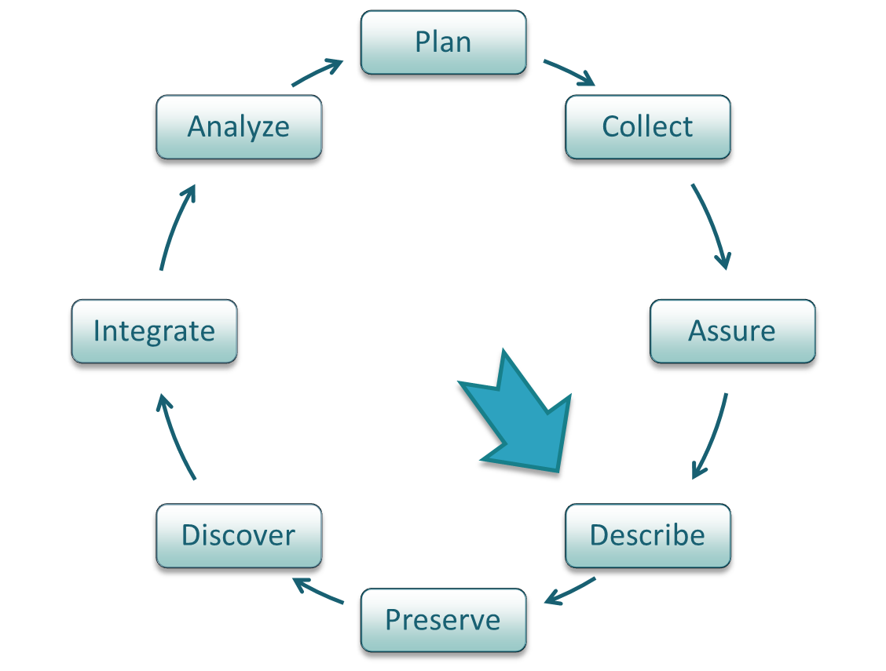
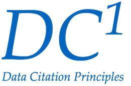
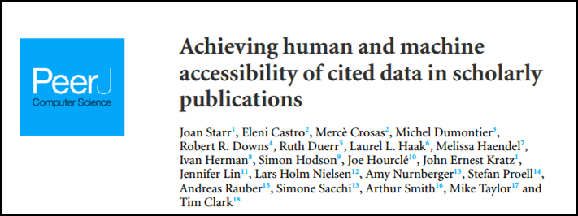
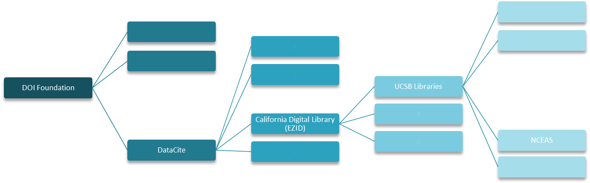
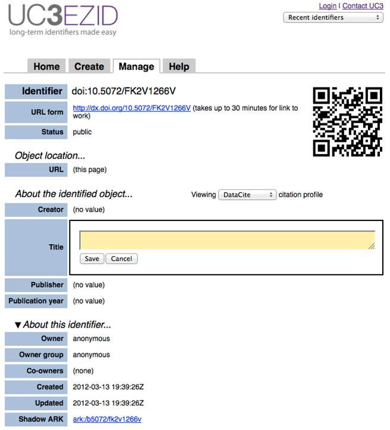
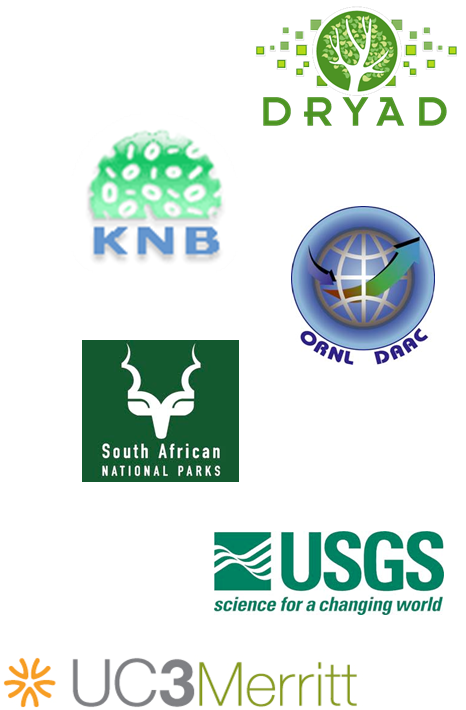

 
## Data Citation

*Image attribution: CC image by adesigna on Flickr*

---

## Lesson Topics

.one-half[* Data Citation in the Data Life Cycle
* Definitions: What is Data Citation?
* Benefits of Data Citation
* Collaborating to Support Data Citation
* How to Cite Data
* How to Obtain a Persistent Identifier for a Data Set
* Best Practices to Support Data Citation]

*Image attribution: CC image by cybrarian77 on Flickr*

---

## Learning Objectives

After completing this lesson, the participant will be able to:
.full-width[* Define data citation
* Describe benefits of data citation
* Identify roles of data authors/managers, data publishers, and journal publishers in supporting data citation
* Recognize metadata elements useful for data citation
* Recognize common persistent data locators and describe the process for obtaining one
* Summarize best practices for supporting data citation]

---

## The Data Life Cycle

???

The Data Life Cycle is a continuum of data development, manipulation, management, and storage stages. Data citation is part of the "Describe" phase of the Life Cycle, though it is also related to Preservation and Discovery.

---

## Definitions

### Data citation
.full-width[* The practice of providing a reference to data in the same way as researchers routinely provide a bibliographic reference to printed resources.
* A key practice underpinning the recognition of data as a primary research output rather than as a by-product of research]
<footer>Australian National Data Service (ANDS), Data Citation Awareness Guide. Accessed May 10, 2012 at http://ands.org.au/guides/data-citation-awareness.html.</footer>

---

## Definitions

### Data author
.full-width[* Individual involved in research, education, or other activities that generate digital data that are subsequently deposited in a data collection]
<footer>National Science Board, Long-Lived Digital Data Collections: Enabling Research and Education in the 21st Century, September, 2005. p. 17. http://www.nsf.gov/pubs/2005/nsb0540/ Accessed May 10, 2012.</footer>

---

## Definitions

### Persistent identifier
.full-width[* A unique web-compatible alphanumeric code that points to a resource (e.g., data set) that will be preserved for the long term (i.e., over several hardware and software generations)]
* Should direct to latest available version of resource or to metadata which enables acquisition of desired version or format]

<footer>Hakala, J. Persistent identifiers – an overview. Accessed May 10, 2012 at http://metadaten-twr.org/2010/10/13/persistent-identifiers-an-overview/.</footer>

???

1. Australian National Data Service (ANDS), Data Citation Awareness Guide. Accessed May 10, 2012 at http://ands.org.au/guides/data-citation-awareness.html. 

2. National Science Board, Long-Lived Digital Data Collections: Enabling Research and Education in the 21st Century, September, 2005. p. 17. http://www.nsf.gov/pubs/2005/nsb0540/ Accessed May 10, 2012.

3. Hakala, J. Persistent identifiers – an overview. Accessed May 10, 2012 at http://metadaten-twr.org/2010/10/13/persistent-identifiers-an-overview/.

---

## Benefits of Data Citation 

### Short term
.two-third[* Facilitates discovery of relationships between data and publications, making it easier to validate and build upon previous work
* Ensures that proper credit can be given when others use your work
* Facilitates impact assessments of datasets based on number of publications that cite them
* Helps researchers re-using data to find other ways the data has been used.]

.one-third[
*Image attribution: CC image by futureatlas.com on Flickr,as "Citation Needed"*]
 
---

## Benefits of Data Citation

### Long term
.two-third[* Promotes the availability of data into the future
* Facilitates discovery of  existing data relevant to a particular question
* Enables recognition of scholarly effort within disciplines and organizations 
* Increases transparency of scientific research]

.one-third[
*Image attribution: CC image by gruntzooki on Flickr*]

???

Adoption of practices that rely on publishing infrastructure help to ensure data will be available in the future --- is this really true? I reworded it, but just thinking about it…nothing is guaranteed…?
Prevents ‘data stealing’ because rules of publication apply to citable data in that it must be cited or treated as plagiarism….
Easier to discover existing data relevant to a particular question

---

## Principles of Data Citation

.two-third[* **Importance** - Data should be considered legitimate, citable products of research
* **Credit and Attribution** - Data citations should facilitate giving scholarly credit and normative and legal attribution to all contributors to the data
* **Evidence** - In scholarly literature, whenever and wherever a claim relies upon data, the corresponding data should be cited.
* **Unique Identification** - A data citation should include a persistent method for identification that is machine actionable, globally unique, and widely used by a community.]

*https://www.force11.org/datacitation*

---

## Principles of Data Citation

.two-third[* **Access** - Data citations should facilitate access to the data, metadata, code, and other materials, as necessary for both humans and machines.
* **Persistence** - Unique identifiers, data, and metadata should persist beyond the lifespan of the data they describe.
* **Specificity and Verifiability** - Data citations should facilitate identification of, access to, and verification of the specific data that support a claim.  
* **Interoperability and Flexibility** - Data citation methods should be flexible, but enable interoperability across communities.]

*https://www.force11.org/datacitation*

---

## How to Cite Data

.two-third[* Similar to citing a published article or book
 * Provide information necessary to identify and locate the work cited
* Broadly-applicable data citation standards have not yet been established; use standards adopted by relevant academic journal, data repository, or professional organization
* In "Achieving human and machine accessibility of cited data in scholarly publications" Starr et al. (2015) begin to lay out implementation guidelines across disciplines1
doi: [10.7717/peerj-cs.1](https://doi.org/10.7717/peerj-cs.1)]

.one-third[]

???

Starr J, Castro E, Crosas M, Dumontier M, Downs RR, Duerr R, Haak LL, Haendel M, Herman I, Hodson S, Hourclé J, Kratz JE, Lin J, Nielsen LH, Nurnberger A, Proell S, Rauber A, Sacchi S, Smith A, Taylor M, Clark T. (2015) Achieving human and machine accessibility of cited data in scholarly publications. PeerJ Computer Science 1:e1 https://doi.org/10.7717/peerj-cs.1

---

## Examples of information needed in a citation 

.one-half[* **Author/Principal Investigator/Data Creator**
* **Release Date/Year of Publication** – year of release, for a completed dataset 
* **Title of Data Source** – formal title of the dataset
* **Version/Edition Number** – the version of the dataset used in the study
* **Format of the Data** – physical format of the data
* **3rd Party Data Producer** – refers to data accessed from a 3rd party repository 
* **Archive and/or Distributor** – the location that holds the dataset]

---

## Examples of information needed in a citation, continued

.full-width[* **Locator or Identifier** – includes Digital Object Identifiers (DOI), Handles, Archival Resource Key (ARK), etc.
* **Access Date and Time** – when data is accessed online
* **Subset of Data Used** – description based on organization of the larger dataset
* **Editor or Contributor** – reference to a person who compiled data, or performed value-added functions
* **Publication Place** – city and state and country of the distributor of the data
* **Data within a Larger Work** – refers to the use of data in a compilation or a data supplement (such as published in a peer-reviewed paper)]

---

## Examples of Data Citation Formats

.two-third[* **DataCite**: Creator (Publication Year): Title. Publisher. Identifier
* **Dryad**: Author (Date of Article Publication) Data from: Article name. Dryad Digital Repository. doi: DOI number]

*Image attribution: CC image by Paxsimius on Flickr*

---

## Examples of Data Citation Formats, continued

.full-width[* **Earth Science Information Partners (ESIP)1**:
 * Required citation elements: Author. Release date. Title. Version. Archive/Distributor. Locator/Identifier. Access date and time.
 * Optional citation elements: Subset Used; Editor, Compiler, or other important role; Distributor, Associate Archive, or other Institutional Role; Data Within a Larger Work
 * Example citation: 
   * Zwally, H. J., R. Schutz, C. Bentley, J. Bufton, T. Herring, J. Minster, J. Spinhirne, and R. Thomas. 2011. GLAS/ICESat L1A Global Altimetry Data, Version 33. [Indicate subset used]. Boulder, Colorado USA. NASA National Snow and Ice Data Center Distributed Active Archive Center. doi: http://dx.doi.org/10.5067/ICESAT/GLAS/DATA121. [Date Accessed].]

???

More guidelines/suggestions from ESIP: http://wiki.esipfed.org/index.php/Interagency_Data_Stewardship/Citations/provider_guidelines

---

## Examples of Data Citation Formats, continued

.full-width[* **Research Data Alliance (RDA)**:
 * The RDA Working Group on Data Citation (WG-DC)1 aims to bring together a group of experts to discuss the issues, requirements, advantages and shortcomings of existing approaches for efficiently citing subsets of data.
 * Final recommendations of the WG-DC were published in “Data Citation of Evolving Data” in 20152.
 * *Recommended citation elements*: persistent query identification and storage on versioned data; based on timestamping, a specific subset can be retrieved by re-executing the query. 
 * Example citation:
   * Stefan Proell (2015) “Austria Facts” created at 2015-10-07 10:51:55:0, PID[ark:12345/qmZi2wO2vv]. Subset of CIA: “The CIA World Factbook”, PID[ark:12345/cLfH9FjxnA].]

???

1. https://www.rd-alliance.org/groups/data-citation-wg.html
2. https://www.rd-alliance.org/system/files/documents/RDA-DC-Recommendations_150609.pdf

---

## What are examples of Persistent Identifiers?

.full-width[A **persistent identifier** should be included in the citation:
* DOI (Digital Object Identifier)
 * Globally unique, alphanumeric string assigned by a registration agency to identify content and provide a persistent link to its location. 
 * May be assigned to any item of intellectual property that is defined by structured metadata
 * Examples:10.1234/NP5678, 10.5678/ISBN-0-7645-4889-4; 10.2224/2004-10-ISO-DOI

* ARK (Archival Resource Key)
 * URL designed to support long-term access to information objects
 * Can refer to digital, physical, or intangible objects or living beings and groups
 * Example: http://ark.cdlib.org/ark:/13030/tf5p30086k]

???

DOIs always start with 10.
http://www.doi.org
https://wiki.ucop.edu/display/Curation/ARK

---

## What are examples of Persistent Identifiers?

.full-width[More persistent identifiers:
* UUID (Universally Unique Identifier)
 * 'practically unique' identifiers that can be generated by distributed systems but later combined into a single database without needing to resolve identifier (ID) conflicts
 * 32 hexadecimal digits, displayed in five groups separated by hyphens, in the form 8-4-4-4-12 for a total of 36 characters
 * Example: 550e8400-e29b-41d4-a716-446655440000

* Researcher identifier: ORCID (Open Researcher & Contributor ID)
 * Central registry of unique identifiers for individual researchers to address author name ambiguity
 * Transparent linking mechanism between ORCID and other author ID schemes]

???

http://www.doi.org
https://wiki.ucop.edu/display/Curation/ARK

---

## How to obtain a DOI for a dataset

.two-third[* Contact organization/institution that can create DOIs
 * Organization hierarchy
 

* 20+ services registered through DataCite include
 * California Digital Library’s EZID
 * ANDS Cite My Data Service
 * DataCite Canada]

???

http://n2t.net/ezid

Note: DOI's imply a long term commitment to making the data accessible and that the data should go to/be in a place willing to make that commitment.

---

## How to obtain a DOI for a dataset, continued

.one-half[
* Provide data and necessary citation profile (metadata)
 * DataCite: creator, title, publisher, publication year
 * Dublin Core: creator, title, publisher, date
 * ERC: who, what, when
 * Additional information: owner, owner group, co-owners
* Receive DOI to be used for citation purposes
]

.one-half[

]

???

http://n2t.net/ezid

Note: DOI's imply a long term commitment to making the data accessible and that the data should go to/be in a place willing to make that commitment.

---

## Collaborative effort

.one-half[* Requires participation of a variety of individuals and institutions
 * Journal publishers
 * Data publishers/repositories
 * Data authors
 * Data managers
 * Data users
 * Professional organizations]
 

*Image attribution: CC image via Wikimedia Commons (Masur, derivative of Al Maghi)*

---

## Collaborating with publishers

.two-third[
* Data authors and managers should:
 * Choose an appropriate repository for data publication
 * Use common standards for data and metadata
 * Work data up to publication standard
 * Obtain citation information from data publisher and include it in associated paper in accordance with journal’s citation standards
 * Include citations for any prior datasets used in research
 * Notify data publisher (e.g., data center or repository) about associated paper(s)
]

.one-third[

]

???

Work data up to publication standard – what does this mean? 

Dryad

Knowledge Network for Biocomplexity (KNB)

Oak Ridge National Laboratory Distributed Active Archive Center (ORNL DAAC)

South Africa National Parks

United States Geological Survey

UC Curation Center Merritt

---
 
## Collaborating with publishers

.full-width[* Data centers or distributors should
 * Ensure that data and metadata remain accessible, robust, and usable over time
 * Assign persistent and unique identifiers so that data are discoverable
 * Make data citation information easily findable by data users
 
* Journal publishers should
 * Provide clear guidance on how and where data sets should be cited
 * Be responsive to needs of authors, funding agencies, and data repositories
 * Alert data publisher when publishing a paper that cites a data set]
 

*Image attribution: https://pixabay.com/en/collaboration-collaborator-book-1106196/*

---

## Best Practices to Support Data Citation

.full-width[* To support access to your data:
 * Use application that supports metadata creation for environmental data sets
    * Morpho
    * Metavist (USDA Forest Service)
    * Mermaid (NOAA)
 * Use standardized keywords to describe your data
    * Biocomplexity Thesaurus (USGS)
    * Global Change Master Directory (NASA)
 * Use a persistent identifier such as DOI or ARK]

---

## Best Practices to Support Data Citation, continued

.full-width[* Work with journal publishers and data repositories to archive data during the publication process
 * Allows information about how to access your data set to be published with your article
   * Note: Data repositories typically offer to embargo archived data for a pre-determined time period after publication
 * Allows article citation/DOI to be included with archived data set]
 
 
## Best Practices to Support Data Citation, continued 

.full-width[* Encourage other data authors to cite data and to make their own data available for reuse:
 * Provide full citation information for data whenever you publish work that makes use of another author’s data
 * Archive your own data in a repository that supports data discovery and reuse
 * Update your archived data sets when newer versions are available]
 
---

## Citation of Scientific Software

*Image attribution: https://pixabay.com/en/code-programming-hacking-html-web-820275/*

*"Software citation is an evolving area. A web search for ‘how to cite software’ and its variants shows that this is a popular question. The answers can broadly be classed into citation formats recommended by journals, citation formats recommended/mandated by software providers and, most contentious, the view that software is not a citable output."*

`- Mike Jackson, Software Sustainability Institute`

???

http://www.software.ac.uk/how-cite-and-describe-software?mpw

---

## Citation of Scientific Software

### Why cite software?
* Software itself may be considered to be data or a research product.
* Findings of a study are not only based on data, but on the software used to support the analysis of the data.
* Software citation is essential for enabling reproducibility of results.
* Give proper attribution to the developers/authors of software.

### When to cite software?
* "Standard" office software (e.g. Word, Excel) and programming languages do not need formal citations. 
* DO provide citations for specialized/custom software or programs  when their use directly impacts the results.

---

## Examples of information needed in software citations

Similar to data citation, software citations should include:
* **Title/Name of the Software**
* **Author/Developer** – if known
* **Release Date/Year**
* **Version Number** – the version of the software/program used
* **Descriptor** – the text"[computer program]" (including brackets) is often included in the citation 
* **Publisher name and location** – if applicable
* **URL** – if the software is available online, provide the URL
* **DOI** – if one exists for the software, cite it

---

## Examples of Software Citation

Software purchased off-the-shelf1:
* Product Name. Version. Release Date. Publisher. Location.
 * SuperScience. 1.2. December 2012. Research Software. Edinburgh, UK.

Software downloaded from the web1:
* Product Name. Version. Release Date. Publisher. Location. DOI or URL. Download Date.
  * OGSA-DAI REST. 4.2.1. December 2012. OGSA-DAI Project. http://sourceforge.net/projects/ogsa-dai. 27/04/2012.

Software provided by a researcher1:
* Product Name. Author. Location. Contact Details. Received Date.
 * BestFFTroutine ever file. Fred Bloggs, EPCC, The University of Edinburgh, UK. Fred.bloggs@epcc.ed.ac.uk. 27/04/2012.

AMA Format2:
 * Epi Info [computer program]. Version 3.2. Atlanta, GA: Centers for Disease Control and Prevention; 2004.

APA Format3:
 * Hayes, B. et al. (2003). OTSoft: Optimality Theory Software (Version 2.1) [Software]. Available from http://www.linguistics.ucla.edu/people/hayes/otsoft/
 
???

1. Format & examples from: http://software.ac.uk/so-exactly-what-software-did-you-use
2. See: http://www.amamanualofstyle.com/view/10.1093/jama/9780195176339.001.0001/med-9780195176339-div2-86 and http://blogs.library.ucla.edu/biomedical/2011/11/02/cite-it-right-citing-software-or-software-manuals-databases-and-legal-references/
3. https://owl.english.purdue.edu/owl/resource/560/10/

---

## Software Citation Resources

* **The Software Sustainability Institute**: http://www.software.ac.uk/
* **Working towards Sustainable Software for Science Practice and Experiences (WSSSPE)**: http://wssspe.researchcomputing.org.uk/
* **NSF Workshop on Supporting Scientific Discovery through Norms and Practices for Software and Data Citation and Attribution**: https://softwaredatacitation.org/Pages/home.aspx
* **Software Carpentry and Data Carpentry**: http://software-carpentry.org/ and http://www.datacarpentry.org/

---

## Resources

1. Australian National Data Service (ANDS), Data Citation Awareness Guide. Accessed April 9, 2015 at http://ands.org.au/guides/data-citation-awareness.html. 
2. Ball, A. & Duke, M. (2011). How to Cite Datasets and Link to Publications. DCC How-to Guides. Edinburgh: Digital Curation Centre. Accessed April 9, 2015 at http://www.dcc.ac.uk/resources/how-guides.
3. CODATA-ICSTI Task Group on Data Citation Standards and Practices. (2013). Out of Cite, Out of Mind: The Current State of Practice, Policy, and Technology for the Citation of Data. Data Science Journal, 12: CIDCR1 - CIDCR75. Accessed April 9, 2015 at http://dx.doi.org/10.2481/dsj.OSOM13-043.
4. Costello, M. J. (2009). Motivating Online Publication of Data. BioScience, 59(5): 418-427. Accessed April 9, 2015 at http://www.bioone.org/doi/full/10.1525/bio.2009.59.5.9.
5. CrossCite DOI Citation Formatter. Accessed April 9, 2015 at http://crosscite.org/citeproc/.
6. Data Citation Principles Glossary. FORCE11. Accessed April 9, 2015 at Accessed April 9, 2015 at https://www.force11.org/node/4770.

---

## Resources, continued

7. Data Citation Synthesis Group. (2014). Joint Declaration of Data Citation Principles. Martone, M. (ed.). San Diego, CA: FORCE11. Accessed April 9, 2015 at https://www.force11.org/datacitation. 
8. Duke, C. S. & Porter, J. H. (2013). The Ethics of Data Sharing and Reuse in Biology. BioScience 63: 483-489. Accessed April 9, 2015 at http://dx.doi.org/10.1525/bio.2013.63.6.10. 
9. ESIP Federation Interagency Data Stewardship/Citations/Provider Guidelines. Accessed April 9, 2015 at http://bit.ly/data_citation. 10. Hakala, J. Persistent identifiers – an overview. Accessed April 9, 2015 at http://metadaten-twr.org/2010/10/13/persistent-identifiers-an-overview/.
11. Starr J, Castro E, Crosas M, Dumontier M, Downs RR, Duerr R, Haak LL, Haendel M, Herman I, Hodson S, Hourclé J, Kratz JE, Lin J, Nielsen LH, Nurnberger A, Proell S, Rauber A, Sacchi S, Smith A, Taylor M, Clark T. (2015) Achieving human and machine accessibility of cited data in scholarly publications. PeerJ Computer Science 1:e1 https://doi.org/10.7717/peerj-cs.1
12. Jackson, Mike. 2012. How to cite and describe software. Software Sustainability Institute. http://www.software.ac.uk/how-cite-and-describe-software?mpw. Accessed May 12, 2016.

---
## About
Participate in our GitHub repo: [https://dataoneorg.github.io/dataone_lessons/](https://dataoneorg.github.io/dataone_lessons/)

The full slide deck (in PowerPoint) may be downloaded from:
[http://www.dataone.org/education-modules](http://www.dataone.org/education-modules)

**Suggested citation:**
DataONE Education Module: Data Management. DataONE. Retrieved November 12, 2016. From [http://www.dataone.org/sites/all/documents/L01_DataManagement.pptx](http://www.dataone.org/sites/all/documents/L01_DataManagement.pptx)

**Copyright license information:**
No rights reserved; you may enhance and reuse for your own purposes.  We do ask that you provide appropriate citation and attribution to DataONE.

---

---
