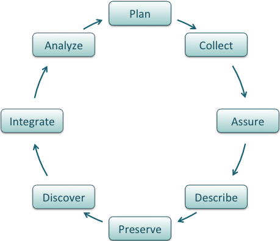
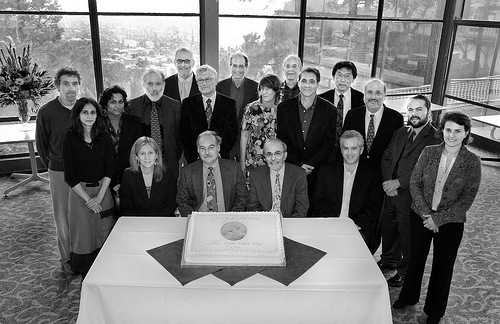

# Data Sharing

.three-fourth-center[
*Public domain image from Unsplash*
]

???

This is Lesson 2 of the DataONE Data Management learning series. This lesson covers Data Management: Data Sharing

---

# Lesson Topics

- Data sharing within the **data lifecycle**
- **Value** of data sharing
- **Concerns** about data sharing
- **Methods** for making data reusable

.three-fourth-center[
]

???

The topics covered in this lesson include: the role of data sharing within the lifecycle, the value of data sharing, concerns about data sharing, and methods for making data sharable.

---

# Learning Objectives
.two-third[
**After completing this lesson,** the participant will be able to:

1. Discuss data sharing considerations within the data lifecycle
2. Recognize the benefits of sharing scientific data
3. Address concerns about sharing data
4. Outline a process for making data sharable
5. Identify mechanisms for sharing data
]

.one-third[]

???

After completing this lesson, you will be able to recognize the benefits of sharing scientific data, address concerns about sharing data, outline a process for making data sharable, and identify mechanisms for sharing data.

---

# The Data Lifecycle
Data sharing should be addressed throughout the data lifecycle.
.center[]

???

Data sharing should be addressed throughout the Data Life Cycle
[Guide to social science data preparation and archiving: Best practice throughout the data life cycle](http://www.icpsr.umich.edu/files/ICPSR/access/dataprep.pdf), 4th edition (ICPSR, 2009)

---

# The Data Lifecycle

Several stages require critical attention to ensure effective data sharing

| Step         | Action                                                        |
|:-------------|:--------------------------------------------------------------|
| **Describe** | document the data content, character and process              |
| **Deposit**  | store the data in a location from which it can be accessed    |
| **Preserve** | select storage formats and media with long term use in mind   |
| **Discover** | publish information about the data so that others can find it |

???

Effective data sharing requires careful thought during each stage of the data development process including:

* description and documentation of the data process, content, and character;
* deposition and storage of the data in a location from which it can be accessed or shared;
* preservation of the data using a format and media that enable long term reuse; and
* making the data discoverable by publishing information about the data in research publications, data clearinghouses and data distribution portals.

---

# Why share data

Data sharing requires effort, resources, and faith in others. Why do it?

.one-half[For the benefit of:
* the public
* the research sponsor
* the research community
* the researcher
]

.one-half[

*CC image by Jessica Lucia on Flickr*
]

???

Why expend the extra effort to share data? Because it benefits the public, the research sponsor, the research community and, perhaps most importantly, the researcher.

---

# Value of Data Sharing: To the Public

A better informed public yields better decision making with regard to:

.two-third[* Environmental and economic **planning**
* Federal, state, and local **policies**
* **social choices** such as use of tax dollars and education options
* personal **lifestyle and health** such as nutrition and recreation
]

.one-third[
*CC image by falonyates on Flickr*
]

???

How does the public benefit from shared research?
The more informed the public the better they are able to understand and contribute toward effective public and personal decisions:

* environmental and economic planning
* federal, state and local policies
* social choices such as voting, use of tax dollars and education options
* personal lifestyles and health choices such as exercise, smoking, and nutrition

Australian Bureau of Statistics, National Statistical Service (2009) A good practice guide to sharing your data with others, Vers. 1. http://www.nss.gov.au/nss/home.nsf/NSS/E6C05AE57C80D737CA25761D002FD676?opendocument

Niu, J. (2006). Reward and Punishment Mechanisms for Research Data Sharing. IASSIST Quarterly, Winter 2006.

---

# Value of Data Sharing: To Research Sponsor

* Organizations that sponsor research must maximize the value of research dollars
* Data sharing enhances the value of research investments by enabling:
  * verification of performance **metrics and outcomes**
  * new research and increased **return on investment**
  * advancement of the **science**
  * **reduced** data duplication **expenditures**
  * enhancing and **extending the record** of science

???

Why do research sponsors encourage data sharing? Because sponsors have an obligation to maximize the investment of research dollars.

Data sharing enhances the value of the research investment by enabling external reviewers to verify the project performance metrics and outcomes. This not only increases the credibility of the data but also spurs new research that can build upon the initial investment and advance the science rather than duplicate expenditures.

[Guide to social science data preparation and archiving: Best practice throughout the data life cycle](http://www.icpsr.umich.edu/files/ICPSR/access/dataprep.pdf), 4th edition (ICPSR, 2009)

Piwowar, H.A. (2011). A new task for NSF reviewers:  Recognizing the value of data reuse. http://researchremix.wordpress.com/2011/05/28/dear-nsf-reviewers/

---

# Value of Data Sharing: To Scientific Community

Access to related research enables community members to:
.one-half[* build upon the work of others and further, rather than repeat, the science
* perform meta analyses that cannot be performed with individual datasets or laboratories
* share resources and perspectives so that comprehension is expanded and enhanced
]

.one-half[

*CC image by Lawrence Berkeley National Laboratory on Flickr*
]

???

The scientific community as a whole also benefits from sharing among researchers. Data sharing allows researchers to build upon one another's work and to further, rather than duplicate, the science by exploring new findings or combining findings into meta analyses that cannot be performed with individual data. In sharing data, the scientific community expands both individual perspectives and the collective comprehension.

Guide to social science data preparation and archiving: Best practice throughout the data life cycle http://www.icpsr.umich.edu/files/ICPSR/access/dataprep.pdf, 4th edition (ICPSR, 2009)

Piwowar HA, Becich MJ, Bilofsky H, Crowley RS, on behalf of the caBIG Data Sharing and Intellectual Capital Workspace (2008) Towards a Data Sharing Culture: Recommendations for Leadership from Academic Health Centers. PLoS Med 5(9): e183. doi:10.1371/journal.pmed.0050183

Teeters, J.L., Harris, K.D., Millman, K.J., Olshausen, B.A., Sommer, F.T. (2008). Data Sharing for Computational Neuroscience. Neuroinform, DOI 10.1007s12021-008-9009-y

National Institute of Health (NIH) (2003). NIH Data Sharing Policy and Implementation Guidelines.

Borgman, C.L. Research Data: Who will share what, with whom, when, and why? In Proceedings of the China-North American Library Conference, Beijing , September 2010. (http://works.bepress.com/borgman/238/)

---

# Value of Data Sharing: To Scientific Community

Access to related research enables community members to (cont’d):

* increase transparency, reproducibility and comparability of results
* expand methodology assessment, recommendations and improvement
* educate new researchers as to the most current and significant findings

???

Access to related research enables members of the scientific community to better reproduce, compare and assess methods and results. Scientists are able to learn from one another and educate new researchers as to the most current and significant findings.

---

# Value of Data Sharing: To the Scientist
.two-third[
Scientists that share data gain the benefit of:

* research sponsor recognition as an authoritative source and wise investment
* improved data quality due to expanded use, field checks, and feedback
* greater opportunity for data exchange
* improved connections to scientific network, peers, and potential collaborators
]

.one-third[

*CC image by SLU Madrid Campus on Flickr*
]

???

And finally, how does the independent researcher benefit from data sharing? When scientists share their data, they gain recognition as an authoritative source and respect as a wise investment for research dollars. When data are exposed, feedback from the broader community can be used to improve the quality and presentation of the data. Shared data also allows for greater opportunity for data exchange and networking opportunities with peers and potential collaborators.

* Piwowar HA, Becich MJ, Bilofsky H, Crowley RS, on behalf of the caBIG Data Sharing and Intellectual Capital Workspace (2008) Towards a Data Sharing Culture: Recommendations for Leadership from Academic Health Centers. PLoS Med 5(9): e183. doi:10.1371/journal.pmed.0050183
* Teeters, J.L., Harris, K.D., Millman, K.J., Olshausen, B.A., Sommer, F.T. (2008). Data Sharing for Computational Neuroscience. Neuroinform, DOI 10.1007s12021-008-9009-y
* Borgman, C.L. Research Data: Who will share what, with whom, when, and why? In Proceedings of the China-North American Library Conference, Beijing , September 2010. (http://works.bepress.com/borgman/238/)

---

# Concerns About Data Sharing
Even if the value of data sharing is recognized, concerns remain as to the impacts of increased data exposure.

.three-fourth-center[
*Public domain image by succo on pixabay*
]

---

# Concerns About Data Sharing

Researchers may worry that the data will be taken out of context, misinterpreted or used inappropriately.

| Problem                                                                     | Solution |
|:----------------------------------------------------------------------------|:---------:|
| inappropriate use due to misunderstanding of research purpose or parameters | **?**    |
| security and confidentiality of sensitive data                              | **?**    |
| lack of acknowledgement / credit                                            | **?**    |
| loss of advantage when competing for research dollars                       | **?**    |

???

Researchers may worry that the data will be taken out of context, misinterpreted or used inappropriately. They may also be concerned about maintaining the confidentiality and security of sensitive data. Business concerns may arise as well. Will data users give proper credit and acknowledgement to the scientist? Will the scientist lose a competitive advantage by sharing this valuable resource?

* Niu, J. (2006). Reward and Punishment Mechanisms for Research Data Sharing. IASSIST Quarterly, Winter 2006.
* Guide to social science data preparation and archiving: Best practice throughout the data life cycle, 4th edition (ICPSR, 2009)
* Borgman, C.L. Research Data: Who will share what, with whom, when, and why? In Proceedings of the China-North American Library Conference, Beijing , September 2010. (http://works.bepress.com/borgman/238/)

---

# Concerns About Data Sharing

Each of these issues can, in great part, be addressed by providing rich data documentation known as ‘metadata’.

| Problem                                                                     | Solution     |
|:----------------------------------------------------------------------------|:-------------:|
| inappropriate use due to misunderstanding of research purpose or parameters | **metadata** |
| security and confidentiality of sensitive data                              | **metadata** |
| lack of acknowledgement / credit                                            | **metadata** |
| loss of advantage when competing for research dollars                       | **metadata** |

???

Each of these issues can, in great part, be addressed by providing rich data documentation known as ‘metadata’.

* Niu, J. (2006). Reward and Punishment Mechanisms for Research Data Sharing. IASSIST Quarterly, Winter 2006.
* Guide to social science data preparation and archiving: Best practice throughout the data life cycle, 4th edition (ICPSR, 2009)
* Borgman, C.L. Research Data: Who will share what, with whom, when, and why? In Proceedings of the China-North American Library Conference, Beijing , September 2010. (http://works.bepress.com/borgman/238/)

---

# Concerns About Data Sharing

The metadata does NOT contain the data.

| Problem | Solution     |
|:---------------|:----------------------|
| inappropriate use due to misunderstanding of research purpose or parameters | provide rich Abstract, Purpose, Use Constraints and Supplemental Information where needed |
| security and confidentiality of sensitive data | Use Constraints specify who may access the data and how |                  

---

# Concerns About Data Sharing Cont'd

Consider audiences, usability, versions.

| Problem | Solution     |
|:---------------|:----------------------|
| lack of acknowledgement / credit | specify a required data citation within the Use Constraints |
| loss of advantage when competing for research dollars | create second, public version with generalized Data Processing Description |

---

# Best Practices for Sharing Data (1)

Shared data should align with the FAIR principles:

| FAIR | Principle | How to check |
|:----:|:----------|:----------|
| **F** | Findable | Do the data have a unique ID? Are they discoverable via web search? |
| **A** | Accessible | Can the data be accessed without logging in or paywalls? |
| **I** | Interoperable | Can the data be used by humans and computers without special software? |
| **R** | Re-usable | Do the data have sufficient metadata and clear reuse policies?|

<footer>https://www.force11.org/group/fairgroup/fairprinciples</footer>

Let's see how to put these principles into practice in the next slides...

---

# Best Practices for Sharing Data (2)

The primary goal of sharing data is to support reuse, by you and others. In this light, here are *"Nine simple ways to make it easier to (re)use your data"* [1]

- **Share your data (1)**
 - An obvious but critical first step.
- **Provide metadata (2)**
 - "The first key to using data is understanding it."
- **Provide an unprocessed form of the data (3)**
 - The most useful data is often in raw form.
- **Use standard data formats (4)**
 - file formats that are non-proprietary and can be read by most software
 - table formats that follow spreadsheet best practices
 - standard formats within cells

<footer>[1] White, Ethan P., Elita Baldridge, Zachary T. Brym, Kenneth J. Locey, Daniel J. McGlinn, and Sarah R. Supp. ‘Nine Simple Ways to Make It Easier to (re)use Your Data’. Ideas in Ecology and Evolution 6, no. 2 (30 August 2013). doi:10.4033/iee.v6i2.4608.</footer>

???

See this GREAT paper for more information about each of these important aspects of sharing data in a useful way.

---

# Best Practices for Sharing Data (3)

The primary goal of sharing data is to support reuse, by you and others. In this light, here are *"Nine simple ways to make it easier to (re)use your data"* [1]

- **Use good null values (5)**
 - Practices vary across discipline and software. Pick one & document the choice in your metadata.
- **Make it easy to combine your data with other datasets (6)**
 - Include important contextual information that's common in your field
- **Perform basic quality control (7)**
- **Use an established repository (8)**
- **Use an established and open license (9)**

<footer>[1] White, Ethan P., Elita Baldridge, Zachary T. Brym, Kenneth J. Locey, Daniel J. McGlinn, and Sarah R. Supp. ‘Nine Simple Ways to Make It Easier to (re)use Your Data’. Ideas in Ecology and Evolution 6, no. 2 (30 August 2013). doi:10.4033/iee.v6i2.4608.</footer>

???

See this GREAT paper for more information about each of these important aspects of sharing data in a useful way.

---

# Data in Real Life

In 2003, a group of scientists from the National Institutes of Health, the Food and Drug  Administration, drug and medical imaging industries, universities, and nonprofit groups joined in a collaborative effort to find the biological markers  that show the progression of Alzheimer’s disease in the human brain.

The goal of this project was to do research on a massive scale that would involve sharing and making accessible all the data uncovered to anyone in the world with a computer.

Dr. John Trojanowski an Alzheimer’s researcher at the University of Pennsylvania stated,  “It’s not science the way most of us have practiced it in our careers. But we all realized that we would never get biomarkers unless all of us parked our egos and intellectual-property noses outside the door and agreed that all of our data would be made public immediately.”
http://www.nytimes.com/2010/08/13/health/research/13alzheimer.html

???

In 2003, a group of scientists from the National Institutes of Health, the Food and Drug Administration, drug and medical imaging industries, universities, and nonprofit groups joined in a collaborative effort to find the biological markers that show the progression of Alzheimer’s disease in the human brain.

The goal of this project was to do research on a massive scale that would involve sharing and making accessible all the data available to anyone in the world with a computer.

Dr. John Trojanowski, an Alzheimer’s researcher at the University of Pennsylvania, stated “It’s not science the way most of us have practiced it in our careers. But we all realized that we would never get biomarkers unless all of us parked our egos and intellectual-property noses outside the door and agreed that all of our data would be made public immediately.”

[Our “Data in Real Life” segment features a news report on this research. (?)]

---

# Summary

* Data sharing adds value to the data
* It is the responsibility of the researcher to share their data
* Metadata supports data accountability, liability, and usability
* Sponsors expect, some require, data to be shared
* Data sharing is essential to the advancement of science
* Make data Findable, Accessible, Interoperable, and Re-usable by following nine simple steps

.center[
*Public domain image from Unsplash*
]

???

In summary, data sharing adds value to the data. As such, it is the responsibility of the researcher to share their data. Metadata should be created for data resources to support data accountability, liability and usability. Research sponsors expect, and increasingly require, data to be shared.
 
THIS CONCLUDES Lesson 2.

To assess your learning on the content presented in this lesson, proceed to the next slide take the quiz.

---
# References

White, Ethan P., Elita Baldridge, Zachary T. Brym, Kenneth J. Locey, Daniel J. McGlinn, and Sarah R. Supp. **‘Nine Simple Ways to Make It Easier to (re)use Your Data’**. Ideas in Ecology and Evolution 6, no. 2 (30 August 2013). <a href="http://dx.doi.org/10.4033/iee.v6i2.4608">doi:10.4033/iee.v6i2.4608.</a>

Wilson, Greg, Jennifer Bryan, Karen Cranston, Justin Kitzes, Lex Nederbragt, and Tracy K. Teal. **‘Good Enough Practices in Scientific Computing’**. arXiv:1609.00037 [cs], 31 August 2016. http://arxiv.org/abs/1609.00037.

Gil, Yolanda, Cédric H. David, Ibrahim Demir, Bakinam T. Essawy, Robinson W. Fulweiler, Jonathan L. Goodall, Leif Karlstrom, et al. **‘Towards the Geoscience Paper of the Future: Best Practices for Documenting and Sharing Research from Data to Software to Provenance’**. Earth and Space Science, 1 July 2016, 2015EA000136. <a href="http://dx.doi.org/10.1002/2015EA000136">doi:10.1002/2015EA000136</a>.

**<a href="https://www.force11.org/group/fairgroup/fairprinciples">Force11 FAIR Principles</a>** for data sharing

???

More stuff:

* Inter-university Consortium for Political and Social Research (ICPSR), ICPSR Guide to Data Preparation and Archiving: Best Practice Throughout the Data Life Cycle (ICPSR, 2009; http://www.icpsr.umich.edu/files/ICPSR/access/dataprep.pdf). [4th Edition]
* Australian Bureau of Statistics - National Statistical Service (ABS-NSS), A good practice guide to sharing your data with others (ABS-NSS, 2009; http://www.nss.gov.au/nss/home.nsf/NSS/E6C05AE57C80D737CA25761D002FD676?opendocument). [Vers. 1]
* H.A. Piwowar, A new task for NSF reviewers:  Recognizing the value of data reuse. ResearchRemix vers. May 28, 2011 (http://researchremix.wordpress.com/2011/05/28/dear-nsf-reviewers/).  [blog posting of draft]
* H.A. Piwowar, M.J. Becich, H. Bilofsky, R.S. Crowley, Towards a Data Sharing Culture: Recommendations for Leadership from Academic Health Centers. PLoS Med. 5(9), e183 (2008), doi:10.1371/journal.pmed.0050183. [on behalf of the caBIG Data Sharing and Intellectual Capital Workspace]
* National Institute of Health (NIH) “NIH Data Sharing Policy and Implementation Guidelines” (NIH, Washington D.C., 2003, http://grants.nih.gov/grants/policy/data_sharing/data_sharing_guidance.htm).
* J. Niu, “Reward and Punishment Mechanisms for Research Data Sharing”. IASSIST Quarterly, Winter (2006).
* C.L. Borgman, “Research Data: Who will share what, with whom, when, and why?” in Proceedings of the China-North American Library Conference, Beijing , September 2010 (http://works.bepress.com/borgman/238/)

---

# About

Participate in our GitHub repo: [https://github.com/DataONEorg/Education](https://github.com/DataONEorg/Education)

**Suggested citation:**
DataONE Education Module: Data Sharing. DataONE. Retrieved November 12, 2016. From [https://dataoneorg.github.io/Education/](https://dataoneorg.github.io/Education/)

**Copyright license information:**
No rights reserved; you may enhance and reuse for your own purposes.  We do ask that you provide appropriate citation and attribution to DataONE.

